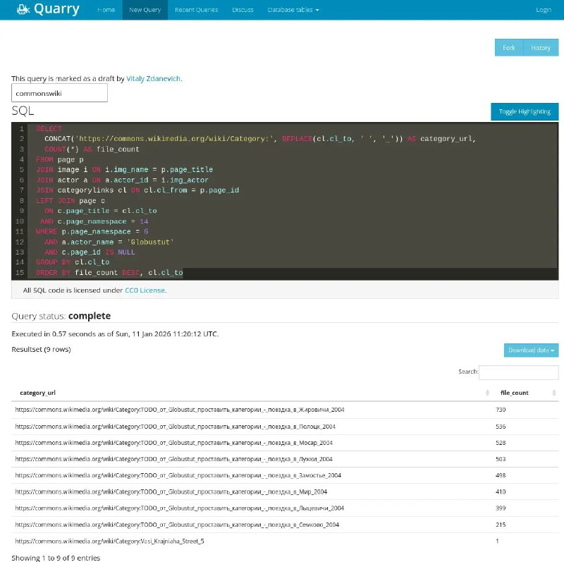

+++
title = ""
date = 2026-01-11T11:34:33+00:00
description = "Wow on wikimediacommons we can write sql, for example to get red categories with files, for a specific user"

[taxonomies]
days = ["2026-01-11"]
tags = ["wikimedia_commons", "sql"]

[extra]
id = 871
day = "2026-01-11"
tg_url = "https://t.me/vitaly_zdanevich_chan/871"
og_image = "5413490665691221626_1260426516_460000890.jpg"
next_id = 872
next_title = ""
prev_id = 870
prev_title = ""
views = 20
ids = [871]
+++

Wow on {{ tag(t="wikimedia_commons") }} we can write {{ tag(t="sql") }}, for example to get red categories with files, for a specific user <https://quarry.wmcloud.org/query/100891>

