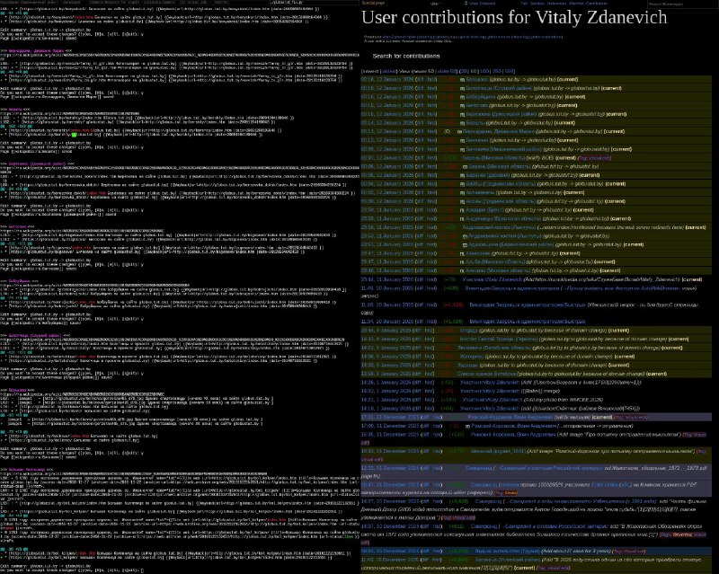

+++
title = ""
date = 2026-01-12T00:17:43+00:00
description = "Wow wikipedia semi-automatic editing by a python script"

[taxonomies]
days = ["2026-01-12"]
tags = ["wikipedia", "python"]

[extra]
id = 872
day = "2026-01-12"
tg_url = "https://t.me/vitaly_zdanevich_chan/872"
og_image = "5413674120924303146_1260469230_460001066.jpg"
next_id = 873
next_title = ""
prev_id = 871
prev_title = ""
views = 17
ids = [872]
+++

Wow {{ tag(t="wikipedia") }} semi-automatic editing by a {{ tag(t="python") }} script  

<https://gitlab.com/vitaly-zdanevich/globustut-domain-move-on-wikipedia>

