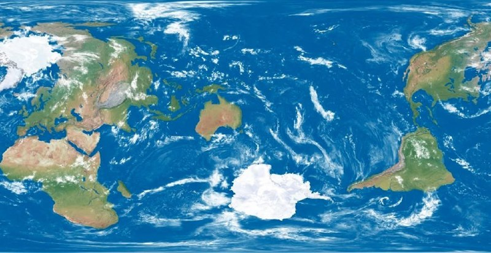

+++
title = "The Earth, centred around new_zealand"
date = 2026-01-12T09:43:35+00:00
description = "map The Earth, centred around newzealand Source"

[taxonomies]
tags = ["map", "new_zealand"]

[extra]
tg_url = "https://t.me/vitaly_zdanevich_chan/873"
og_image = "5413674120924303858_1260469230_460001778.jpg"
next_id = 874
next_title = "I was not active here."
prev_id = 872
prev_title = "Wow wikipedia semi-automatic editing by a python script"
views = 25
ids = [873]
+++

{{ tag(t="map") }}

The Earth, centred around {{ tag(t="new_zealand") }}

[Source](https://www.facebook.com/share/p/1CEN8od24T/)

