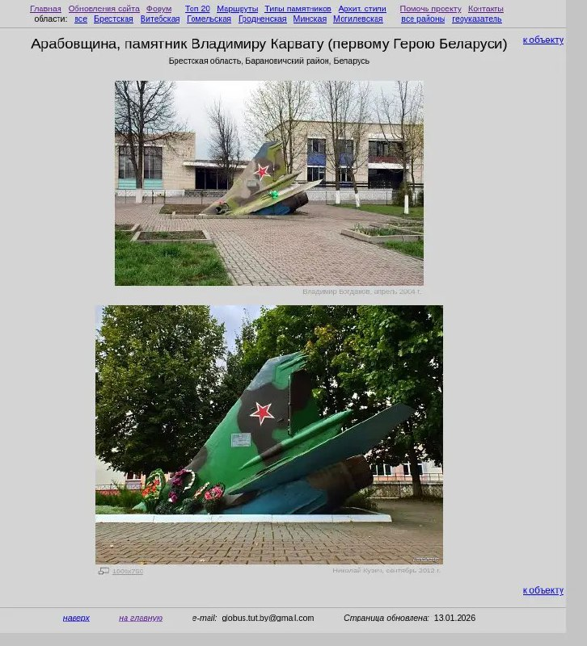

+++
title = "monument belarus globustut airplane"
date = 2026-01-13T00:40:20+00:00
description = "monument belarus globustut airplane Source"

[taxonomies]
tags = ["monument", "belarus", "globustut", "airplane"]

[extra]
tg_url = "https://t.me/vitaly_zdanevich_chan/875"
og_image = "5415925920737988965_1260993518_460001637.jpg"
next_id = 876
next_title = "macOS: to install git I need 25 GB"
prev_id = 874
prev_title = "I was not active here."
views = 15
ids = [875]
+++

{{ tag(t="monument") }}<https://orda.of.by/.add/gallery.php?arabovschi/tail>{{ tag(t="belarus") }}
{{ tag(t="globustut") }}
{{ tag(t="airplane") }}

[Source](https://orda.of.by/.add/gallery.php?arabovschi/tail)

