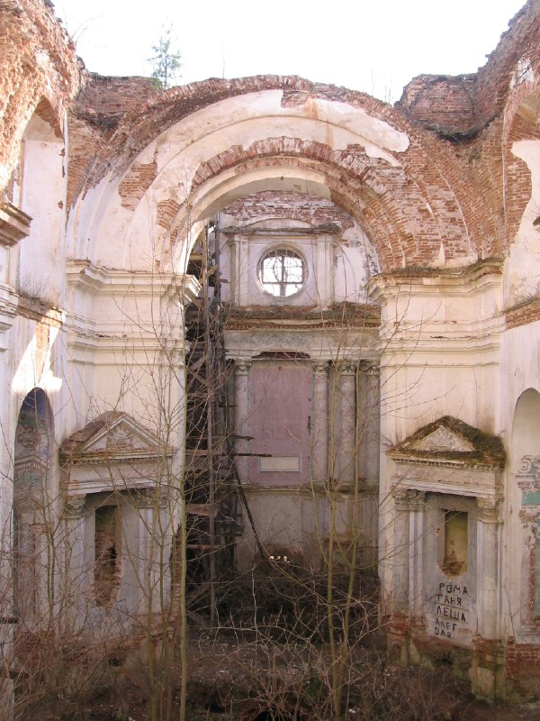

+++
title = ""
date = 2026-01-14T18:20:55+00:00
description = "belarus church globustut abandone Source.%D0%A4%D1%80%D0%B0%D0%B3%D0%BC%D1%8D%D0%BD%D1%82%D1%8B.07.jpg)"

[taxonomies]
days = ["2026-01-14"]
tags = ["belarus", "church", "globustut", "abandone"]

[extra]
id = 877
day = "2026-01-14"
tg_url = "https://t.me/vitaly_zdanevich_chan/877"
og_image = "5422584726364556597_1262543892_460000565.jpg"
next_id = 878
next_title = ""
prev_id = 876
prev_title = ""
views = 11
ids = [877]
+++

{{ tag(t="belarus") }}  
{{ tag(t="church") }}  
{{ tag(t="globustut") }}  
{{ tag(t="abandone") }}  

[Source](https://be-tarask.wikipedia.org/wiki/%D0%A4%D0%B0%D0%B9%D0%BB:%D0%9A%D0%B0%D1%81%D1%8C%D1%86%D1%91%D0%BB_%D0%9D%D0%B0%D0%B9%D1%81%D1%8C%D0%B2%D1%8F%D1%86%D0%B5%D0%B9%D1%88%D0%B0%D0%B9_%D0%A2%D1%80%D0%BE%D0%B9%D1%86%D1%8B_(%D0%9B%D1%8B%D1%81%D0%BA%D0%B0%D0%B2%D0%B0)._%D0%A4%D1%80%D0%B0%D0%B3%D0%BC%D1%8D%D0%BD%D1%82%D1%8B._07.jpg)

