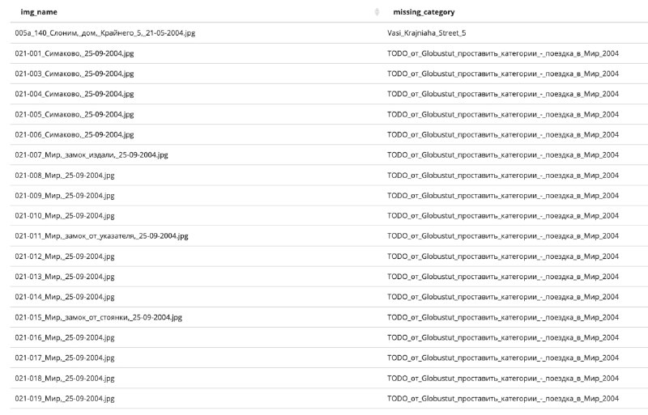

+++
title = ""
date = 2026-01-16T19:27:30+00:00
description = "sql quarry globustut commons: files from a specific user in a non-existing categories, sql: sql SELECT imgname, clto AS missingcategory FROM image JOIN actor ON actorid = imgactor JOIN page ON…"

[taxonomies]
days = ["2026-01-16"]
tags = ["sql", "quarry", "globustut", "commons"]

[extra]
id = 886
day = "2026-01-16"
tg_url = "https://t.me/vitaly_zdanevich_chan/886"
og_image = "5429641422056394562_1264186907_460001090.jpg"
next_id = 887
next_title = ""
prev_id = 879
prev_title = ""
views = 11
ids = [886]
+++

{{ tag(t="sql") }}
{{ tag(t="quarry") }}
{{ tag(t="globustut") }}
{{ tag(t="commons") }}: files from a specific user in a non-existing categories, {{ tag(t="sql") }}:

```
sql
SELECT
    img_name,
    cl_to AS missing_category
  FROM image
  JOIN actor ON actor_id = img_actor
  JOIN page ON page_namespace = 6 AND page_title = img_name
  JOIN categorylinks ON cl_from = page_id
  LEFT JOIN page AS cat
    ON cat.page_namespace = 14
   AND cat.page_title = cl_to
  WHERE actor_name = 'Globustut'
    AND cat.page_id IS NULL
  ORDER BY img_name;
```

<https://quarry.wmcloud.org/query/101097>


