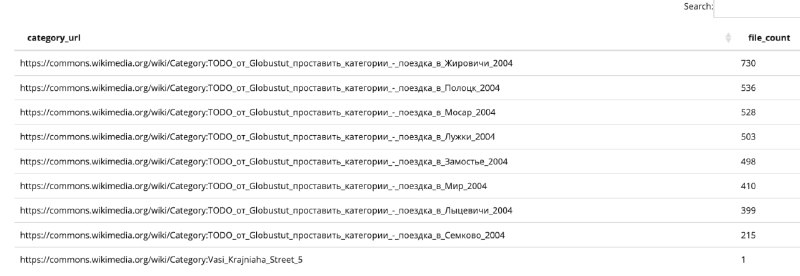

+++
title = ""
date = 2026-01-16T19:34:56+00:00
description = "sql quarry globustut commons: red category links with one or more files from a specific user SELECT CONCAT(' REPLACE(cl.clto, ' ', '')) AS categoryurl, COUNT() AS filecount FROM page p JOIN image i…"

[taxonomies]
days = ["2026-01-16"]
tags = ["sql", "quarry", "globustut", "commons"]

[extra]
id = 888
day = "2026-01-16"
tg_url = "https://t.me/vitaly_zdanevich_chan/888"
og_image = "5429641422056394581_1264186907_460001109.jpg"
next_id = 889
next_title = ""
prev_id = 887
prev_title = ""
views = 15
ids = [888]
+++

{{ tag(t="sql") }}
{{ tag(t="quarry") }}
{{ tag(t="globustut") }}
{{ tag(t="commons") }}: red category links with one or more files from a specific user

```
SELECT
    CONCAT('https://commons.wikimedia.org/wiki/Category:', REPLACE(cl.cl_to, ' ', '_')) AS category_url,
    COUNT(*) AS file_count
  FROM page p
  JOIN image i ON i.img_name = p.page_title
  JOIN actor a ON a.actor_id = i.img_actor
  JOIN categorylinks cl ON cl.cl_from = p.page_id
  LEFT JOIN page c
    ON c.page_title = cl.cl_to
   AND c.page_namespace = 14
  WHERE p.page_namespace = 6
    AND a.actor_name = 'Globustut'
    AND c.page_id IS NULL
  GROUP BY cl.cl_to
  ORDER BY file_count DESC, cl.cl_to
```


