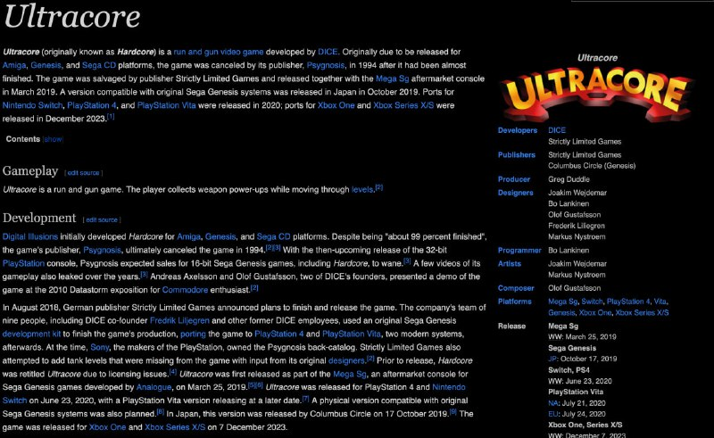

+++
title = ""
date = 2026-01-17T15:39:10+00:00
description = "game sega segagenesis revive ultracore wikipedia Ultracore (originally known as Hardcore) is a run and gun video game developed by DICE. Originally due to be released for Amiga, Genesis, and Sega CD…"

[taxonomies]
days = ["2026-01-17"]
tags = ["game", "sega", "sega_genesis", "revive", "ultracore", "wikipedia"]

[extra]
id = 890
day = "2026-01-17"
tg_url = "https://t.me/vitaly_zdanevich_chan/890"
og_image = "5431893221870079798_1264711195_460001078.jpg"
next_id = 891
next_title = ""
prev_id = 889
prev_title = ""
views = 76
ids = [890]
+++

{{ tag(t="game") }}
{{ tag(t="sega") }}
{{ tag(t="sega_genesis") }}
{{ tag(t="revive") }}
{{ tag(t="ultracore") }}
{{ tag(t="wikipedia") }}

> Ultracore (originally known as Hardcore) is a run and gun video game developed by DICE. Originally due to be released for Amiga, Genesis, and Sega CD platforms, the game was canceled by its publisher, Psygnosis, in 1994 after it had been almost finished. The game was salvaged by publisher Strictly Limited Games and released together with the Mega Sg aftermarket console in March 2019. A version compatible with original Sega Genesis systems was released in Japan in October 2019. Ports for Nintendo Switch, PlayStation 4, and PlayStation Vita were released in 2020; ports for Xbox One and Xbox Series X/S were released in December 2023

<https://en.wikipedia.org/wiki/Ultracore>

