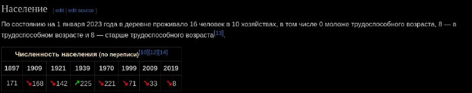

+++
title = "Ясенец (Барановичский район)"
date = 2026-01-18T00:52:54+00:00
description = "Ясенец (Барановичский район) belarus population village"

[taxonomies]
tags = ["belarus", "population", "village"]

[extra]
tg_url = "https://t.me/vitaly_zdanevich_chan/891"
og_image = "5431753231706033102_1264678601_460000206.jpg"
next_id = 892
next_title = "Storing my configs in git (gitlab, because its open - github is not)."
prev_id = 890
prev_title = "Ultracore"
views = 12
ids = [891]
+++

[Ясенец (Барановичский район)](https://ru.wikipedia.org/wiki/%D0%AF%D1%81%D0%B5%D0%BD%D0%B5%D1%86_%28%D0%91%D0%B0%D1%80%D0%B0%D0%BD%D0%BE%D0%B2%D0%B8%D1%87%D1%81%D0%BA%D0%B8%D0%B9_%D1%80%D0%B0%D0%B9%D0%BE%D0%BD%29#%D0%9D%D0%B0%D1%81%D0%B5%D0%BB%D0%B5%D0%BD%D0%B8%D0%B5)

{{ tag(t="belarus") }}
{{ tag(t="population") }}
{{ tag(t="village") }}

