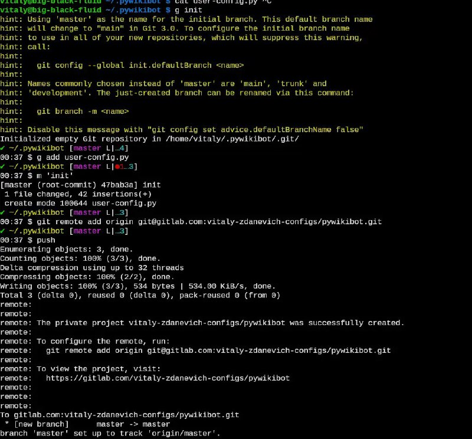

+++
title = ""
date = 2026-01-18T20:56:46+00:00
description = "Storing my configs in git (gitlab, because its open - github is not). Dozens of repos. I recommend you. And I love that Gitlab creates a repo if it does not exist, private by default - so I can…"

[taxonomies]
days = ["2026-01-18"]
tags = ["git", "gitlab", "github", "backup"]

[extra]
id = 892
day = "2026-01-18"
tg_url = "https://t.me/vitaly_zdanevich_chan/892"
og_image = "5434005031519719175_1265202889_460001031.jpg"
next_id = 893
next_title = ""
next_body = "#webdesign\n#arctic\n#year2004\narcticdigitalnomads.com"
prev_id = 891
prev_title = ""
prev_body = "#belarus\n#population\n#village\nSource#%D0%9D%D0%B0%D1%81%D0%B5%D0%BB%D0%B5%D0%BD%D0%B8%D0%B5)"
views = 15
ids = [892]
+++

Storing my configs in {{ tag(t="git") }} ({{ tag(t="gitlab") }}, because its open - {{ tag(t="github") }} is not). Dozens of repos. I recommend you. And I love that Gitlab creates a repo if it does not exist, private by default - so I can {{ tag(t="backup") }} my another preferences folder without touching a web browser.  

As you see - I have git aliases, link to my Bash config file with them <https://gitlab.com/vitaly-zdanevich-configs/bash/-/blob/master/90-aliases.bash>  

```
alias g=git
alias s='git status'
alias d='git diff'
alias ga="git add --patch"
alias m='git commit --message'
alias am='git commit --all --message' # `git commit -am` or `g c -am`
alias push='git push'
alias pull='git pull'
alias log='git log'
alias lo='git log --pretty="%C(Yellow)%h  %C(reset)%ad (%C(Green)%cr%C(reset))%x09 %C(Cyan)%an: %C(reset)%s" --date=short prod..master'
```


