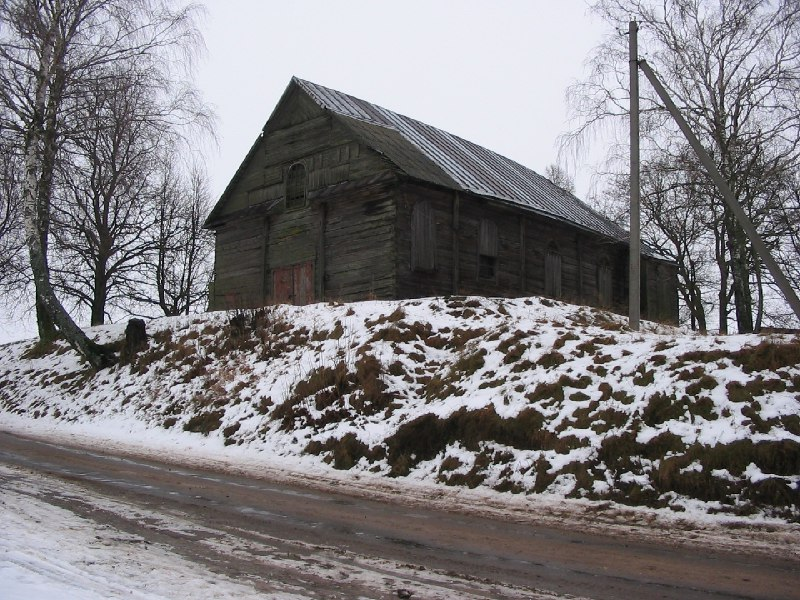

+++
title = ""
date = 2026-01-19T20:44:50+00:00
description = "belarus globustut year2004 Source"

[taxonomies]
days = ["2026-01-19"]
tags = ["belarus", "globustut", "year_2004"]

[extra]
id = 894
day = "2026-01-19"
tg_url = "https://t.me/vitaly_zdanevich_chan/894"
og_image = "5438156503958359169_1266169479_460000385.jpg"
next_id = 895
next_title = ""
next_body = "#belarus\n#blogustut\n#building\n#year2004\nSource"
prev_id = 893
prev_title = ""
prev_body = "#webdesign\n#arctic\n#year2004\narcticdigitalnomads.com"
views = 9
ids = [894]
+++

{{ tag(t="belarus") }}  
{{ tag(t="globustut") }}  
{{ tag(t="year_2004") }}  

[Source](https://commons.wikimedia.org/wiki/File:032-145_%D0%9B%D0%BE%D1%81%D0%BA,_%D0%BA%D0%BE%D1%81%D1%82%D0%B5%D0%BB,_%D1%81%D0%BD%D1%8F%D1%82%D0%BE_4_%D0%B4%D0%B5%D0%BA%D0%B0%D0%B1%D1%80%D1%8F_2004.jpg)

