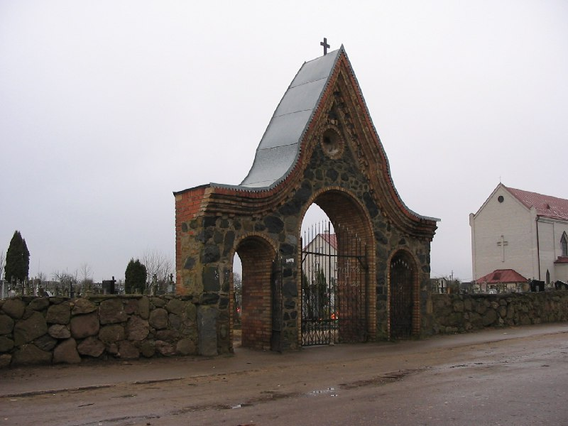

+++
title = ""
date = 2026-01-19T20:57:22+00:00
description = "belarus architecture globustut year2004 Source"

[taxonomies]
days = ["2026-01-19"]
tags = ["belarus", "architecture", "globustut", "year_2004"]

[extra]
id = 896
day = "2026-01-19"
tg_url = "https://t.me/vitaly_zdanevich_chan/896"
og_image = "5438156503958359188_1266169479_460000404.jpg"
next_id = 897
next_title = ""
prev_id = 895
prev_title = ""
views = 7
ids = [896]
+++

{{ tag(t="belarus") }}  
{{ tag(t="architecture") }}  
{{ tag(t="globustut") }}  
{{ tag(t="year_2004") }}  

[Source](https://commons.wikimedia.org/wiki/File:033-219_%D0%92%D0%BE%D1%80%D0%BE%D0%BD%D0%BE%D0%B2%D0%BE,_%D1%81%D0%BD%D1%8F%D1%82%D0%BE_11_%D0%B4%D0%B5%D0%BA%D0%B0%D0%B1%D1%80%D1%8F_2004.jpg)

