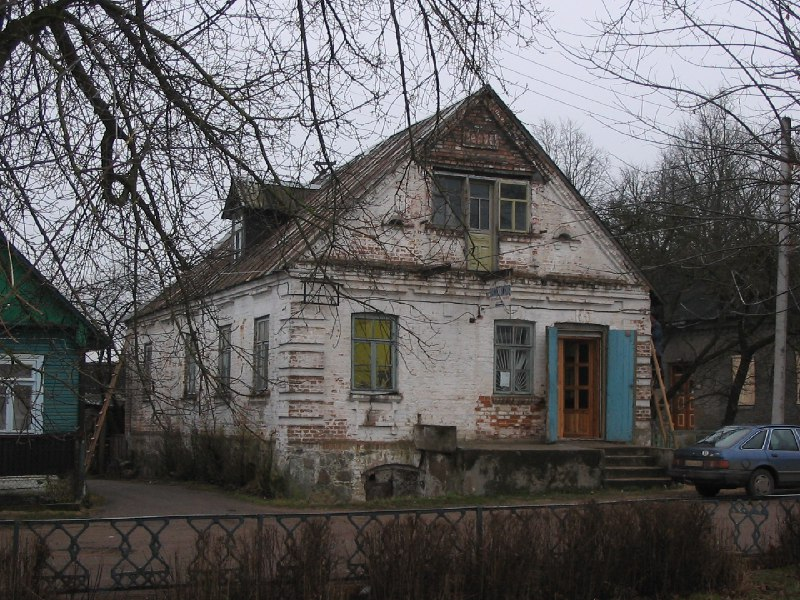

+++
title = "033-460 Острына, снято 11 декабря 2004.jpg"
date = 2026-01-19T21:05:00+00:00
description = "033-460 Острына, снято 11 декабря 2004.jpg belarus architecture globustut year2004"

[taxonomies]
tags = ["belarus", "architecture", "globustut", "year_2004"]

[extra]
tg_url = "https://t.me/vitaly_zdanevich_chan/897"
og_image = "5438156503958359195_1266169479_460000411.jpg"
next_id = 898
next_title = "034-077 Войстом, снято 18 декабря 2004.jpg"
prev_id = 896
prev_title = "033-219 Вороново, снято 11 декабря 2004.jpg"
views = 6
ids = [897]
+++

[033-460 Острына, снято 11 декабря 2004.jpg](https://commons.wikimedia.org/wiki/File:033-460_%D0%9E%D1%81%D1%82%D1%80%D1%8B%D0%BD%D0%B0,_%D1%81%D0%BD%D1%8F%D1%82%D0%BE_11_%D0%B4%D0%B5%D0%BA%D0%B0%D0%B1%D1%80%D1%8F_2004.jpg)

{{ tag(t="belarus") }}
{{ tag(t="architecture") }}
{{ tag(t="globustut") }}
{{ tag(t="year_2004") }}

