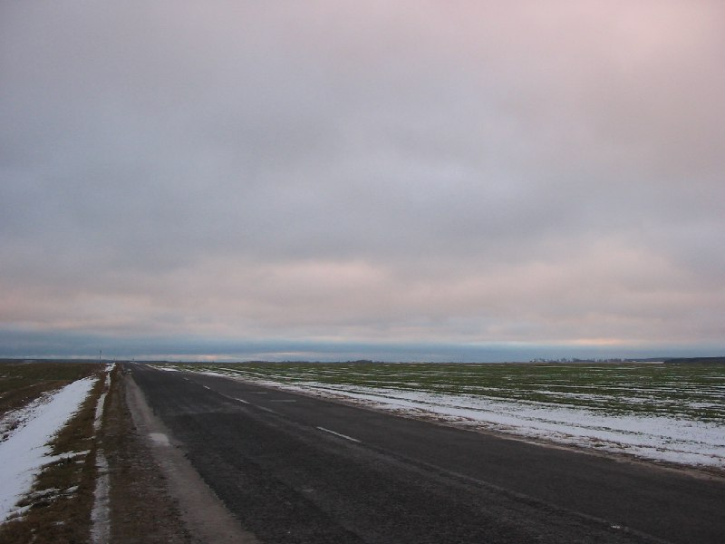

+++
title = ""
date = 2026-01-19T21:23:23+00:00
description = "belarus nature road globustut year2004 Source"

[taxonomies]
days = ["2026-01-19"]
tags = ["belarus", "nature", "road", "globustut", "year_2004"]

[extra]
id = 900
day = "2026-01-19"
tg_url = "https://t.me/vitaly_zdanevich_chan/900"
og_image = "5438156503958359234_1266169479_460000450.jpg"
next_id = 901
next_title = ""
next_body = "#balarus\n#religion\n#sign\n#globustut\n#year2004\nSource"
prev_id = 899
prev_title = ""
prev_body = "#belarus\n#architecture\n#globustut\n#year2004\nSource"
views = 7
ids = [900]
+++

{{ tag(t="belarus") }}  
{{ tag(t="nature") }}  
{{ tag(t="road") }}  
{{ tag(t="globustut") }}  
{{ tag(t="year_2004") }}  

[Source](https://commons.wikimedia.org/wiki/File:035-001_%D0%B1%D0%BB%D0%B8%D0%B7_%D0%91%D0%B5%D1%80%D0%B5%D0%B7%D0%BE%D0%B2%D0%BA%D0%B0,_%D1%81%D0%BD%D1%8F%D1%82%D0%BE_25_%D0%B4%D0%B5%D0%BA%D0%B0%D0%B1%D1%80%D1%8F_2004.jpg)

