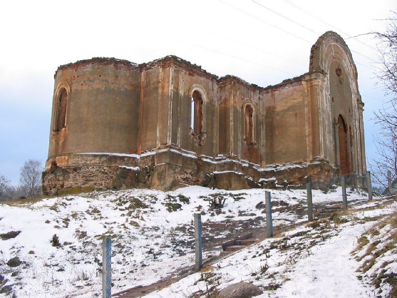

+++
title = "035-222 Холопеничи, снято 25 декабря 2004.jpg"
date = 2026-01-19T21:36:28+00:00
description = "035-222 Холопеничи, снято 25 декабря 2004.jpg belarus architecture church abandone winter year2004 globustut"

[taxonomies]
tags = ["belarus", "architecture", "church", "abandone", "winter", "year_2004", "globustut"]

[extra]
tg_url = "https://t.me/vitaly_zdanevich_chan/904"
og_image = "5438156503958359264_1266169479_460000480.jpg"
next_id = 905
next_title = "036-085 Жердяжье, снято 30 декабря 2004.jpg"
prev_id = 903
prev_title = "035-205 Грицковичи, снято 25 декабря 2004.jpg"
views = 8
ids = [904]
+++

[035-222 Холопеничи, снято 25 декабря 2004.jpg](https://commons.wikimedia.org/wiki/File:035-222_%D0%A5%D0%BE%D0%BB%D0%BE%D0%BF%D0%B5%D0%BD%D0%B8%D1%87%D0%B8,_%D1%81%D0%BD%D1%8F%D1%82%D0%BE_25_%D0%B4%D0%B5%D0%BA%D0%B0%D0%B1%D1%80%D1%8F_2004.jpg)

{{ tag(t="belarus") }}
{{ tag(t="architecture") }}
{{ tag(t="church") }}
{{ tag(t="abandone") }}
{{ tag(t="winter") }}
{{ tag(t="year_2004") }}
{{ tag(t="globustut") }}

