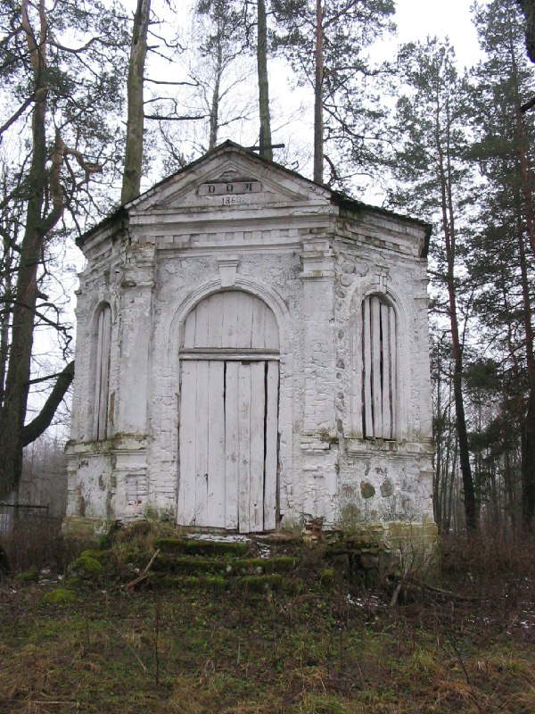

+++
title = "036-085 Жердяжье, снято 30 декабря 2004.jpg"
date = 2026-01-19T21:47:03+00:00
description = "036-085 Жердяжье, снято 30 декабря 2004.jpg belarus architecture abandone winter year2004 globustut"

[taxonomies]
tags = ["belarus", "architecture", "abandone", "winter", "year_2004", "globustut"]

[extra]
tg_url = "https://t.me/vitaly_zdanevich_chan/905"
og_image = "5438156503958359278_1266169479_460000494.jpg"
next_id = 906
next_title = "036-135 Долгиново, снято 30 декабря 2004.jpg"
prev_id = 904
prev_title = "035-222 Холопеничи, снято 25 декабря 2004.jpg"
views = 8
ids = [905]
+++

[036-085 Жердяжье, снято 30 декабря 2004.jpg](https://commons.wikimedia.org/wiki/File:036-085_%D0%96%D0%B5%D1%80%D0%B4%D1%8F%D0%B6%D1%8C%D0%B5,_%D1%81%D0%BD%D1%8F%D1%82%D0%BE_30_%D0%B4%D0%B5%D0%BA%D0%B0%D0%B1%D1%80%D1%8F_2004.jpg)

{{ tag(t="belarus") }}
{{ tag(t="architecture") }}
{{ tag(t="abandone") }}
{{ tag(t="winter") }}
{{ tag(t="year_2004") }}
{{ tag(t="globustut") }}

