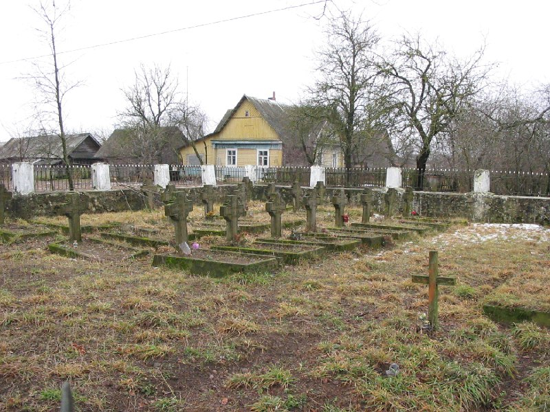

+++
title = "036-135 Долгиново, снято 30 декабря 2004.jpg"
date = 2026-01-19T21:49:48+00:00
description = "036-135 Долгиново, снято 30 декабря 2004.jpg belarus architecture death grave year2004 globustut"

[taxonomies]
tags = ["belarus", "architecture", "death", "grave", "year_2004", "globustut"]

[extra]
tg_url = "https://t.me/vitaly_zdanevich_chan/906"
og_image = "5438156503958359283_1266169479_460000499.jpg"
next_id = 907
next_title = "wow I can edit wikipedia in vim, thanks to"
prev_id = 905
prev_title = "036-085 Жердяжье, снято 30 декабря 2004.jpg"
views = 11
ids = [906]
+++

[036-135 Долгиново, снято 30 декабря 2004.jpg](https://commons.wikimedia.org/wiki/File:036-135_%D0%94%D0%BE%D0%BB%D0%B3%D0%B8%D0%BD%D0%BE%D0%B2%D0%BE,_%D1%81%D0%BD%D1%8F%D1%82%D0%BE_30_%D0%B4%D0%B5%D0%BA%D0%B0%D0%B1%D1%80%D1%8F_2004.jpg)

{{ tag(t="belarus") }}
{{ tag(t="architecture") }}
{{ tag(t="death") }}
{{ tag(t="grave") }}
{{ tag(t="year_2004") }}
{{ tag(t="globustut") }}

