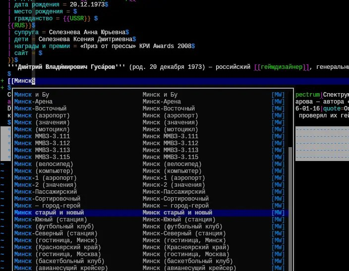

+++
title = ""
date = 2026-01-20T03:20:09+00:00
description = "wow I can edit wikipedia in vim, thanks to to git pull/push and for autocompletion"

[taxonomies]
days = ["2026-01-20"]
tags = ["wikipedia", "vim", "git"]

[extra]
id = 907
day = "2026-01-20"
tg_url = "https://t.me/vitaly_zdanevich_chan/907"
og_image = "5438156503958359420_1266169479_460000636.jpg"
next_id = 908
next_title = ""
prev_id = 906
prev_title = ""
views = 17
ids = [907]
+++

wow I can edit {{ tag(t="wikipedia") }} in {{ tag(t="vim") }}, thanks to

<https://github.com/Git-Mediawiki/Git-Mediawiki> to {{ tag(t="git") }} pull/push

and

<https://github.com/m-pilia/vim-mediawiki>

for autocompletion

