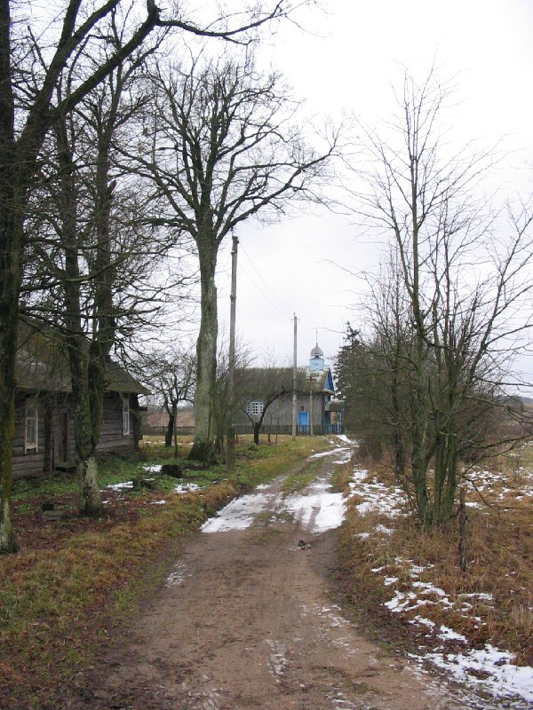

+++
title = ""
date = 2026-01-20T12:50:35+00:00
description = "belarus village year2004 globustut"

[taxonomies]
days = ["2026-01-20"]
tags = ["belarus", "village", "year_2004", "globustut"]

[extra]
id = 908
day = "2026-01-20"
tg_url = "https://t.me/vitaly_zdanevich_chan/908"
og_image = "5440408303772044081_1266693767_460000049.jpg"
next_id = 909
next_title = ""
next_body = "#belarus\n#village\n#year2004\n#globustut"
prev_id = 907
prev_title = ""
prev_body = "wow I can edit #wikipedia in #vim, thanks to\nto #git pull/push\nand\nfor autocompletion"
views = 9
ids = [908]
+++

{{ tag(t="belarus") }}  
{{ tag(t="village") }}  
{{ tag(t="year_2004") }}  
{{ tag(t="globustut") }}  

[https://commons.wikimedia.org/wiki/File:036-168\_Вардомичи,\_снято\_30\_декабря\_2004.jpg](https://commons.wikimedia.org/wiki/File:036-168_%D0%92%D0%B0%D1%80%D0%B4%D0%BE%D0%BC%D0%B8%D1%87%D0%B8,_%D1%81%D0%BD%D1%8F%D1%82%D0%BE_30_%D0%B4%D0%B5%D0%BA%D0%B0%D0%B1%D1%80%D1%8F_2004.jpg)

