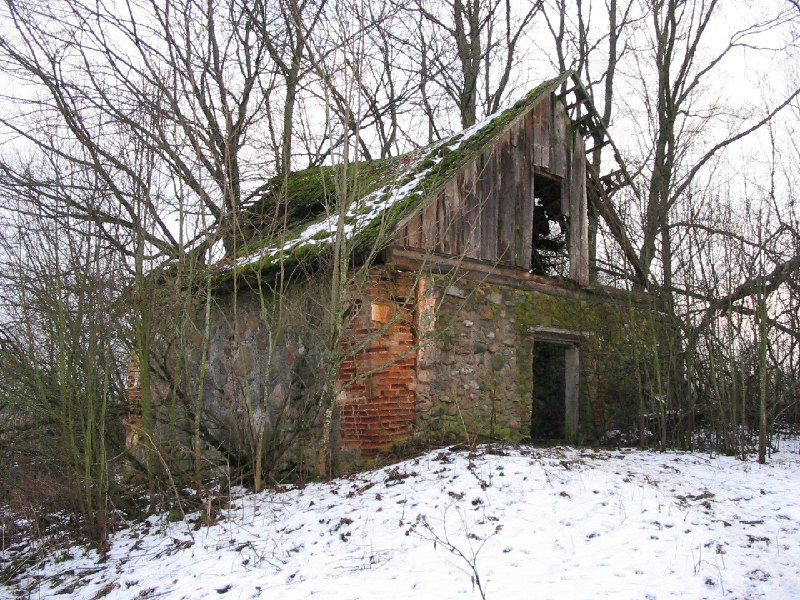

+++
title = ""
date = 2026-01-20T12:56:01+00:00
description = "belarus abandone year2004 globustut"

[taxonomies]
days = ["2026-01-20"]
tags = ["belarus", "abandone", "year_2004", "globustut"]

[extra]
id = 910
day = "2026-01-20"
tg_url = "https://t.me/vitaly_zdanevich_chan/910"
og_image = "5440408303772044104_1266693767_460000072.jpg"
next_id = 911
next_title = ""
next_body = "#belarus\n#winter\n#tractor\n#year2005\n#globustut"
prev_id = 909
prev_title = ""
prev_body = "#belarus\n#village\n#year2004\n#globustut"
views = 8
ids = [910]
+++

{{ tag(t="belarus") }}  
{{ tag(t="abandone") }}  
{{ tag(t="year_2004") }}  
{{ tag(t="globustut") }}  

[https://commons.wikimedia.org/wiki/File:036-278\_Гнездилово,\_снято\_30\_декабря\_2004.jpg](https://commons.wikimedia.org/wiki/File:036-278_%D0%93%D0%BD%D0%B5%D0%B7%D0%B4%D0%B8%D0%BB%D0%BE%D0%B2%D0%BE,_%D1%81%D0%BD%D1%8F%D1%82%D0%BE_30_%D0%B4%D0%B5%D0%BA%D0%B0%D0%B1%D1%80%D1%8F_2004.jpg)

