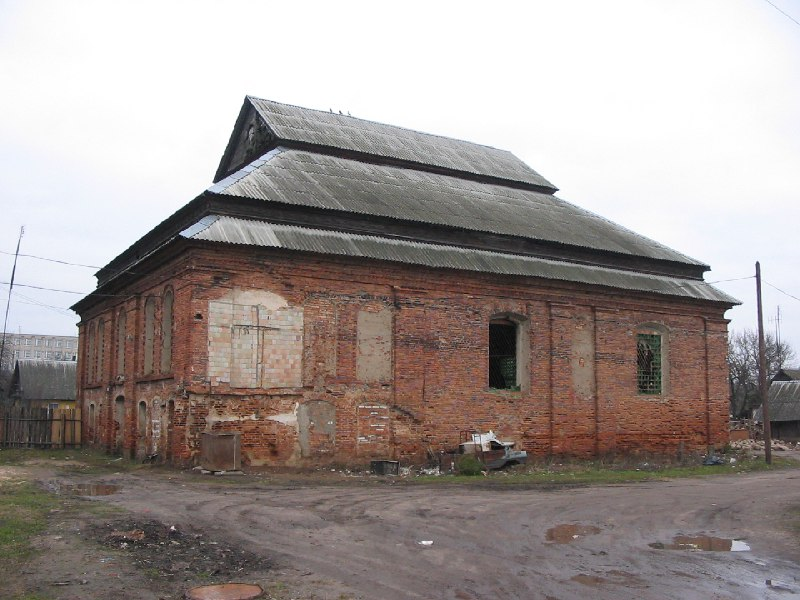

+++
title = "038-110 Ошмяны, снято 12 января 2005.jpg"
date = 2026-01-20T13:12:08+00:00
description = "038-110 Ошмяны, снято 12 января 2005.jpg belarus architecture abandone year2005 globustut"

[taxonomies]
tags = ["belarus", "architecture", "abandone", "year_2005", "globustut"]

[extra]
tg_url = "https://t.me/vitaly_zdanevich_chan/915"
og_image = "5440408303772044160_1266693767_460000128.jpg"
next_id = 916
next_title = "038-151 Болтуп, снято 12 января 2005.jpg"
prev_id = 914
prev_title = "038-073 Двор-Новоселки, снято 12 января 2005.jpg"
views = 8
ids = [915]
+++

[038-110 Ошмяны, снято 12 января 2005.jpg](https://commons.wikimedia.org/wiki/File:038-110_%D0%9E%D1%88%D0%BC%D1%8F%D0%BD%D1%8B,_%D1%81%D0%BD%D1%8F%D1%82%D0%BE_12_%D1%8F%D0%BD%D0%B2%D0%B0%D1%80%D1%8F_2005.jpg)

{{ tag(t="belarus") }}
{{ tag(t="architecture") }}
{{ tag(t="abandone") }}
{{ tag(t="year_2005") }}
{{ tag(t="globustut") }}

