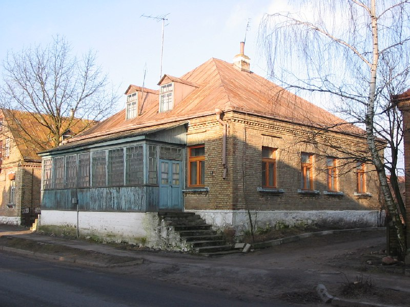

+++
title = ""
date = 2026-01-21T02:45:31+00:00
description = "belarus architecture year2005 globustut"

[taxonomies]
days = ["2026-01-21"]
tags = ["belarus", "architecture", "year_2005", "globustut"]

[extra]
id = 920
day = "2026-01-21"
tg_url = "https://t.me/vitaly_zdanevich_chan/920"
og_image = "5440801563862568206_1266785330_460000526.jpg"
next_id = 921
next_title = ""
prev_id = 919
prev_title = ""
views = 5
ids = [920]
+++

{{ tag(t="belarus") }}  
{{ tag(t="architecture") }}  
{{ tag(t="year_2005") }}  
{{ tag(t="globustut") }}  

[https://commons.wikimedia.org/wiki/File:038-399\_Гольшаны,\_снято\_12\_января\_2005.jpg](https://commons.wikimedia.org/wiki/File:038-399_%D0%93%D0%BE%D0%BB%D1%8C%D1%88%D0%B0%D0%BD%D1%8B,_%D1%81%D0%BD%D1%8F%D1%82%D0%BE_12_%D1%8F%D0%BD%D0%B2%D0%B0%D1%80%D1%8F_2005.jpg)

