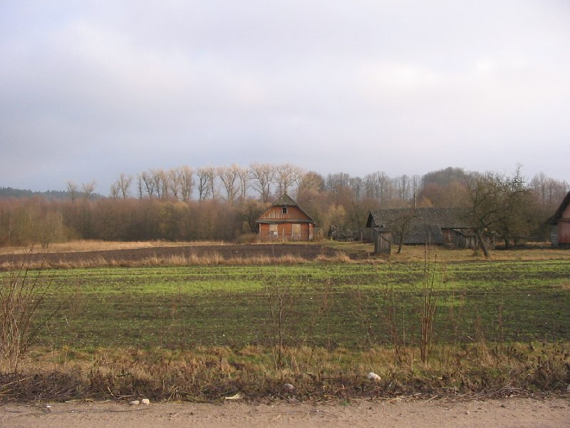

+++
title = "038-478 Маркинята, снято 12 января 2005.jpg"
date = 2026-01-21T02:50:00+00:00
description = "038-478 Маркинята, снято 12 января 2005.jpg belarus architecture nature village year2005 globustut"

[taxonomies]
tags = ["belarus", "architecture", "nature", "village", "year_2005", "globustut"]

[extra]
tg_url = "https://t.me/vitaly_zdanevich_chan/921"
og_image = "5440801563862568208_1266785330_460000528.jpg"
next_id = 922
next_title = "038-497 Михайловщина, снято 12 января 2005.jpg"
prev_id = 920
prev_title = "038-399 Гольшаны, снято 12 января 2005.jpg"
views = 5
ids = [921]
+++

[038-478 Маркинята, снято 12 января 2005.jpg](https://commons.wikimedia.org/wiki/File:038-478_%D0%9C%D0%B0%D1%80%D0%BA%D0%B8%D0%BD%D1%8F%D1%82%D0%B0,_%D1%81%D0%BD%D1%8F%D1%82%D0%BE_12_%D1%8F%D0%BD%D0%B2%D0%B0%D1%80%D1%8F_2005.jpg)

{{ tag(t="belarus") }}
{{ tag(t="architecture") }}
{{ tag(t="nature") }}
{{ tag(t="village") }}
{{ tag(t="year_2005") }}
{{ tag(t="globustut") }}

