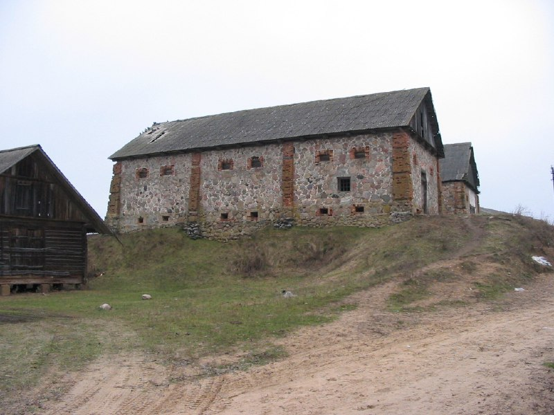

+++
title = ""
date = 2026-01-21T02:55:17+00:00
description = "belarus village year2005 abandone"

[taxonomies]
days = ["2026-01-21"]
tags = ["belarus", "village", "year_2005", "abandone"]

[extra]
id = 923
day = "2026-01-21"
tg_url = "https://t.me/vitaly_zdanevich_chan/923"
og_image = "5440801563862568210_1266785330_460000530.jpg"
next_id = 924
next_title = ""
next_body = "#belarus\n#monument\n#christianity\n#virginmary\n#nature\n#village\n#year2005\n#globustut"
prev_id = 922
prev_title = ""
prev_body = "#belarus\n#abandone\n#year2005\n#globustut"
views = 7
ids = [923]
+++

{{ tag(t="belarus") }}  
{{ tag(t="village") }}  
{{ tag(t="year_2005") }}  
{{ tag(t="abandone") }}  

[https://commons.wikimedia.org/wiki/File:038-534\_Трабы,\_хозпостройки\_из\_бута,\_снято\_12\_января\_2005.jpg](https://commons.wikimedia.org/wiki/File:038-534_%D0%A2%D1%80%D0%B0%D0%B1%D1%8B,_%D1%85%D0%BE%D0%B7%D0%BF%D0%BE%D1%81%D1%82%D1%80%D0%BE%D0%B9%D0%BA%D0%B8_%D0%B8%D0%B7_%D0%B1%D1%83%D1%82%D0%B0,_%D1%81%D0%BD%D1%8F%D1%82%D0%BE_12_%D1%8F%D0%BD%D0%B2%D0%B0%D1%80%D1%8F_2005.jpg)

