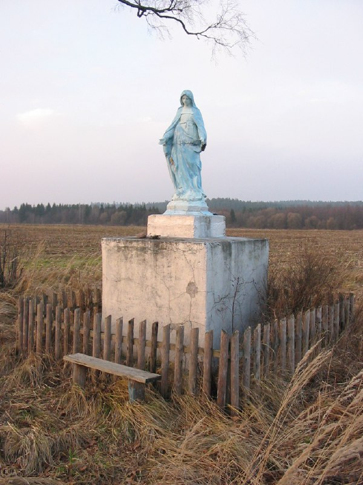

+++
title = ""
date = 2026-01-21T02:59:22+00:00
description = "belarus monument christianity virginmary nature village year2005 globustut"

[taxonomies]
days = ["2026-01-21"]
tags = ["belarus", "monument", "christianity", "virgin_mary", "nature", "village", "year_2005", "globustut"]

[extra]
id = 924
day = "2026-01-21"
tg_url = "https://t.me/vitaly_zdanevich_chan/924"
og_image = "5440801563862568211_1266785330_460000531.jpg"
next_id = 925
next_title = ""
next_body = "#belarus\n#church\n#year2005\n#globustut"
prev_id = 923
prev_title = ""
prev_body = "#belarus\n#village\n#year2005\n#abandone"
views = 7
ids = [924]
+++

{{ tag(t="belarus") }}  
{{ tag(t="monument") }}  
{{ tag(t="christianity") }}  
{{ tag(t="virgin_mary") }}  
{{ tag(t="nature") }}  
{{ tag(t="village") }}  
{{ tag(t="year_2005") }}  
{{ tag(t="globustut") }}  

[https://commons.wikimedia.org/wiki/File:038-638\_Гончары,\_снято\_12\_января\_2005.jpg](https://commons.wikimedia.org/wiki/File:038-638_%D0%93%D0%BE%D0%BD%D1%87%D0%B0%D1%80%D1%8B,_%D1%81%D0%BD%D1%8F%D1%82%D0%BE_12_%D1%8F%D0%BD%D0%B2%D0%B0%D1%80%D1%8F_2005.jpg)

