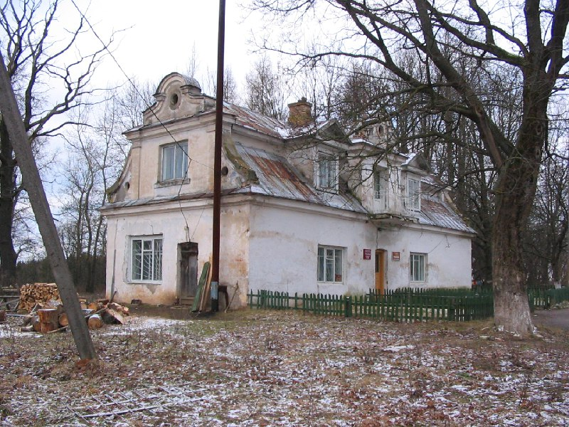

+++
title = ""
date = 2026-01-21T03:12:13+00:00
description = "belarus architecture year2005 globustut"

[taxonomies]
days = ["2026-01-21"]
tags = ["belarus", "architecture", "year_2005", "globustut"]

[extra]
id = 926
day = "2026-01-21"
tg_url = "https://t.me/vitaly_zdanevich_chan/926"
og_image = "5440801563862568223_1266785330_460000543.jpg"
next_id = 927
next_title = ""
prev_id = 925
prev_title = ""
views = 9
ids = [926]
+++

{{ tag(t="belarus") }}
{{ tag(t="architecture") }}
{{ tag(t="year_2005") }}
{{ tag(t="globustut") }}

[https://commons.wikimedia.org/wiki/File:039-460\_Трокеники,\_снято\_15\_января\_2005.jpg](https://commons.wikimedia.org/wiki/File:039-460_%D0%A2%D1%80%D0%BE%D0%BA%D0%B5%D0%BD%D0%B8%D0%BA%D0%B8,_%D1%81%D0%BD%D1%8F%D1%82%D0%BE_15_%D1%8F%D0%BD%D0%B2%D0%B0%D1%80%D1%8F_2005.jpg)

