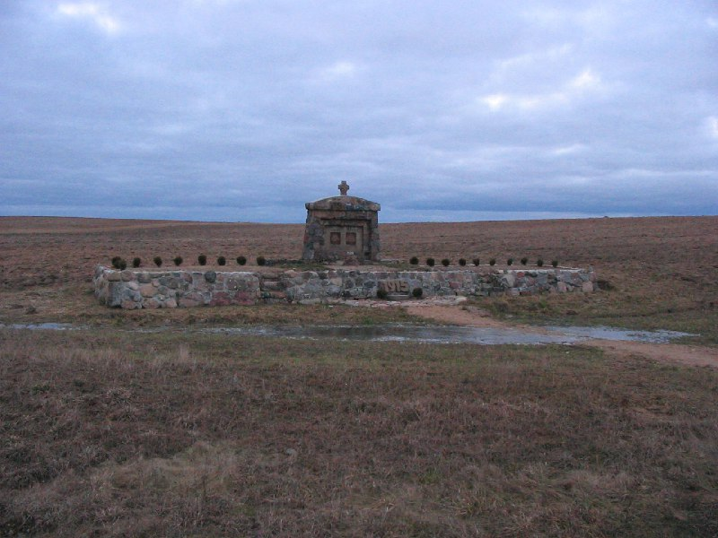

+++
title = ""
date = 2026-01-21T03:15:18+00:00
description = "belarus monument nature year2005 year1915 globustut"

[taxonomies]
days = ["2026-01-21"]
tags = ["belarus", "monument", "nature", "year_2005", "year_1915", "globustut"]

[extra]
id = 927
day = "2026-01-21"
tg_url = "https://t.me/vitaly_zdanevich_chan/927"
og_image = "5440801563862568224_1266785330_460000544.jpg"
next_id = 928
next_title = ""
prev_id = 926
prev_title = ""
views = 10
ids = [927]
+++

{{ tag(t="belarus") }}
{{ tag(t="monument") }}
{{ tag(t="nature") }}
{{ tag(t="year_2005") }}
{{ tag(t="year_1915") }}
{{ tag(t="globustut") }}

[https://commons.wikimedia.org/wiki/File:039-558\_меж\_Тартак\_и\_Нидяны,\_памятник\_1915,\_снято\_15\_января\_2005.jpg](https://commons.wikimedia.org/wiki/File:039-558_%D0%BC%D0%B5%D0%B6_%D0%A2%D0%B0%D1%80%D1%82%D0%B0%D0%BA_%D0%B8_%D0%9D%D0%B8%D0%B4%D1%8F%D0%BD%D1%8B,_%D0%BF%D0%B0%D0%BC%D1%8F%D1%82%D0%BD%D0%B8%D0%BA_1915,_%D1%81%D0%BD%D1%8F%D1%82%D0%BE_15_%D1%8F%D0%BD%D0%B2%D0%B0%D1%80%D1%8F_2005.jpg)

