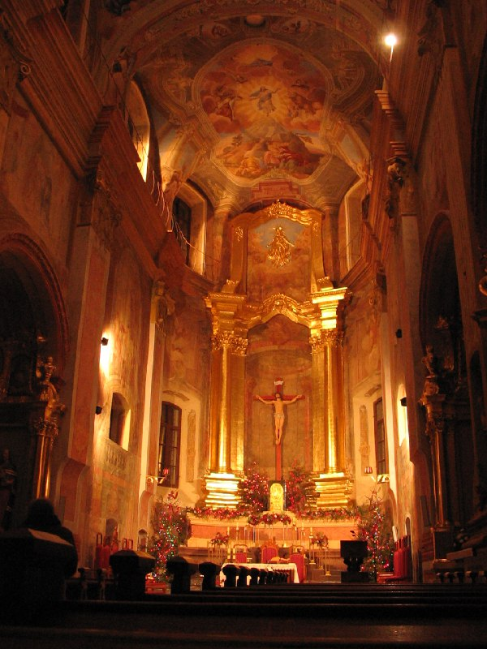

+++
title = ""
date = 2026-01-21T04:07:47+00:00
description = "belarus church year2005 globustut"

[taxonomies]
days = ["2026-01-21"]
tags = ["belarus", "church", "year_2005", "globustut"]

[extra]
id = 929
day = "2026-01-21"
tg_url = "https://t.me/vitaly_zdanevich_chan/929"
og_image = "5440801563862568251_1266785330_460000571.jpg"
next_id = 930
next_title = ""
prev_id = 928
prev_title = ""
views = 13
ids = [929]
+++

{{ tag(t="belarus") }}  
{{ tag(t="church") }}  
{{ tag(t="year_2005") }}  
{{ tag(t="globustut") }}  

[https://commons.wikimedia.org/wiki/File:040-575\_Могилев,\_костел\_Станислава\_(внутри),\_снято\_18\_января\_2005.jpg](https://commons.wikimedia.org/wiki/File:040-575_%D0%9C%D0%BE%D0%B3%D0%B8%D0%BB%D0%B5%D0%B2,_%D0%BA%D0%BE%D1%81%D1%82%D0%B5%D0%BB_%D0%A1%D1%82%D0%B0%D0%BD%D0%B8%D1%81%D0%BB%D0%B0%D0%B2%D0%B0_(%D0%B2%D0%BD%D1%83%D1%82%D1%80%D0%B8),_%D1%81%D0%BD%D1%8F%D1%82%D0%BE_18_%D1%8F%D0%BD%D0%B2%D0%B0%D1%80%D1%8F_2005.jpg)

