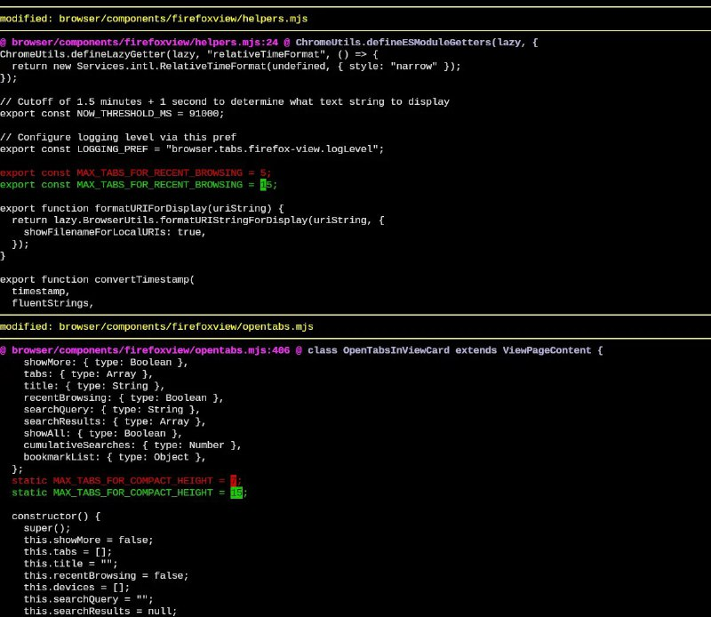
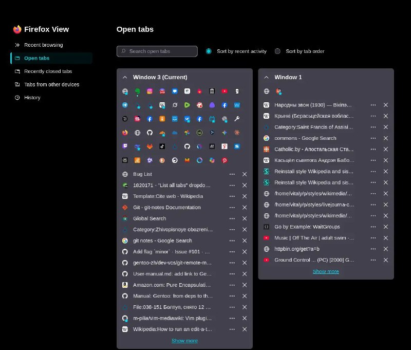

+++
title = ""
date = 2026-01-22T20:44:49+00:00
description = "I am on gentoo because it compiles for my CPU (-march=native and other flags - not generic x64, but I did not measure the performance numbers), and another point - USE flags and the ability to apply…"

[taxonomies]
days = ["2026-01-22"]
tags = ["gentoo"]

[extra]
id = 931
day = "2026-01-22"
tg_url = "https://t.me/vitaly_zdanevich_chan/931"
og_image = "01.jpg"
next_id = 933
next_title = ""
prev_id = 930
prev_title = ""
views = 13
ids = [931]
+++

I am on {{ tag(t="gentoo") }} because it compiles for my CPU (`-march=native` and other flags - not generic x64, but I did not measure the performance numbers), and another point - [USE flags](https://wiki.gentoo.org/wiki/Handbook:AMD64/Working/USE) and the ability to apply source based patches. For example in Firefox in `about:firefoxview` in `Open tabs` we have only 7 elements and no preferences to increase that number, so I found it in the source code and produced a simple patch for my system - and on every update the Portage package manager will try to apply that patch.

