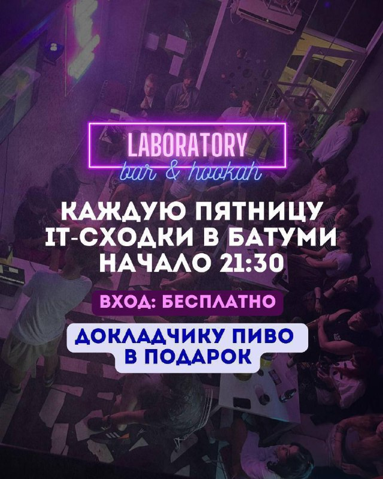

+++
title = ""
date = 2026-01-23T15:14:17+00:00
description = "23января2026 (пт) 21.30-01:00 Айтишные посиделки в Laboratory Bar безоплаты Доклады: [Soft] \"Про Codex от OpenAI: кейс использования: я пишу тесты - он сложные regular expressions, для…"

[taxonomies]
days = ["2026-01-23"]
tags = ["23января2026", "без_оплаты"]

[extra]
id = 933
day = "2026-01-23"
tg_url = "https://t.me/vitaly_zdanevich_chan/933"
og_image = "5443033220279636241_1267304928_460001553.jpg"
next_id = 934
next_title = ""
prev_id = 931
prev_title = ""
views = 14
forwarded_from = "Анонсы Laboratory Bar & Hookah (Batumi)"
forwarded_from_url = "https://t.me/it_laboratory_batumi/771"
ids = [933]
+++

{{ tag(t="23января2026") }} (пт) 21.30-01:00 Айтишные посиделки в Laboratory Bar

{{ tag(t="без_оплаты") }}

Доклады:

> \[Soft\] "Про Codex от OpenAI: кейс использования: я пишу тесты - он сложные regular expressions, для автоматического редактирования Википедии - когда сайт переехал на другой домен", Виталий Зданевич

**🤔** Ты тоже можешь выступить с докладом в неформальной обстановке на большом экране.
Докладчику – пивас в подарок! **☕️****🍺****➡️**Пивко на кране (Lager/IPA), мягкие диванчики и обновленный интеръер=)

Уже целый год мы проводим Friday-IT сходки в Laboratory Bar! За это время было рассказано и показано более 150 уникальных докладов **🔥** на самые разные темы.

**➡️**Расписание
**🗓** 21:00 - Сбор
**💬** 21:30 - Знакомимся с Крякой
**🍺**22:00 - Запасаемся пивом/медовухой/кальяном
**👨‍🏫**22:10 - ~~Конкурс мокрых маек~~ Первый доклад
**🍺**23:10 - Возобновляем запасы пива/кальяна
**👨‍🏫**23:15 - Лучший в городе нетворкинг Айтишников
**🤼**00:00 - Разговоры о высоком/Игры в шахматы

**📍**Адрес: [Laboratory bar (Генерала Мазниашвили 66](https://yandex.com.ge/maps/10278/batumi/house/YEgYcANiS0EHQFprfXp1dnxrYg==/))
**⏰** 21:30-01:00

**💬** Все вопросы – в личку: [@marstut](https://t.me/marstut)

