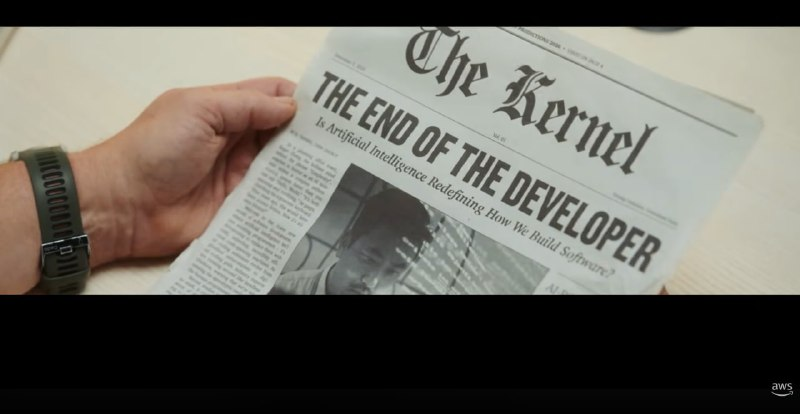

+++
title = ""
date = 2026-01-24T19:03:52+00:00
description = "ai From"

[taxonomies]
days = ["2026-01-24"]
tags = ["ai"]

[extra]
id = 934
day = "2026-01-24"
tg_url = "https://t.me/vitaly_zdanevich_chan/934"
og_image = "5451802121863892081_1269346597_460000369.jpg"
next_id = 935
next_title = ""
next_body = "#vibecoding without human review is #gambling\nFrom"
prev_id = 933
prev_title = ""
prev_body = "#23января2026 (пт) 21.30-01:00 Айтишные посиделки в Laboratory Bar\n#безоплаты\nДоклады:\n[Soft] \"Про Codex от OpenAI: кейс использования: я пишу тесты - он сложные regular expressions, для автоматического редактирования Википедии - когда сайт переехал на другой домен\", Виталий Зданевич\n🤔 Ты тоже можешь выступить с докладом в неформальной обстановке на большом экране.\nДокладчику – пивас в подарок! ☕️🍺➡️Пивко на кране (Lager/IPA), мягкие диванчики и обновленный интеръер=)\nУже целый год мы проводим Friday-IT сходки в Laboratory Bar! За это время было рассказано и показано более 150 уникальных докладов 🔥 на самые разные темы.\n➡️Расписание\n🗓 21:00 - Сбор\n💬 21:30 - Знакомимся с Крякой\n🍺22:00 - Запасаемся пивом/медовухой/кальяном\n👨‍🏫22:10 - Конкурс мокрых маек Первый доклад\n🍺23:10 - Возобновляем запасы пива/кальяна\n👨‍🏫23:15 - Лучший в городе нетворкинг Айтишников\n🤼00:00 - Разговоры о высоком/Игры в шахматы\n📍Адрес: Laboratory bar (Генерала Мазниашвили 66)\n⏰ 21:30-01:00\n💬 Все вопросы – в личку:…"
views = 13
ids = [934]
+++

{{ tag(t="ai") }}  

From <https://youtu.be/3Y1G9najGiI>

{{ youtube(id="3Y1G9najGiI") }}

