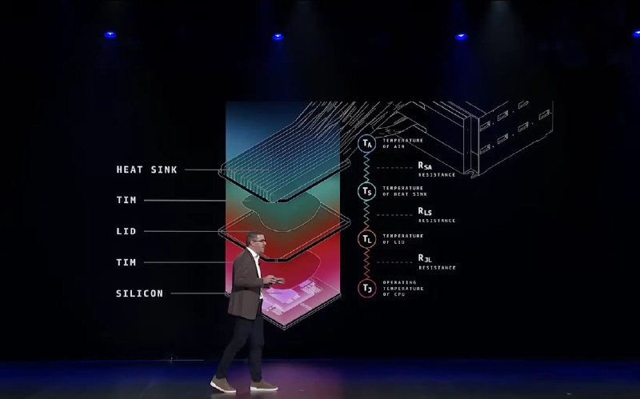
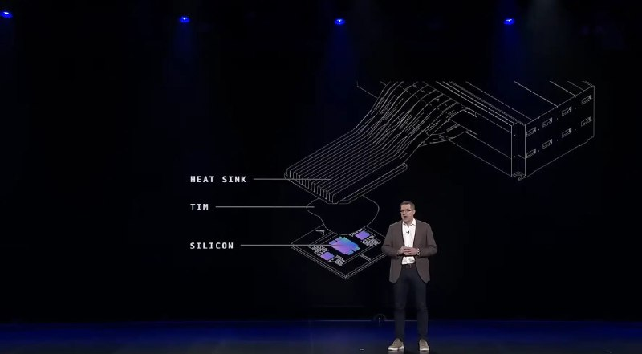

+++
title = ""
date = 2026-01-25T06:05:44+00:00
description = "aws custom cpu: dropped the lid (scalping) for the better cooling"

[taxonomies]
days = ["2026-01-25"]
tags = ["aws", "cpu", "scalping", "cooling"]

[extra]
id = 941
day = "2026-01-25"
tg_url = "https://t.me/vitaly_zdanevich_chan/941"
og_image = "01.jpg"
next_id = 943
next_title = ""
next_body = "#aws\n#cpu\n#memory\n#ram\nFrom"
prev_id = 939
prev_title = ""
prev_body = "#aws CTO Werner Vogels\nMentioned:\nFrom"
views = 8
ids = [941]
+++

{{ tag(t="aws") }} custom {{ tag(t="cpu") }}: dropped the lid ({{ tag(t="scalping") }}) for the better {{ tag(t="cooling") }}  

<https://youtu.be/JeUpUK0nhC0?t=955>

{{ youtube(id="JeUpUK0nhC0") }}

