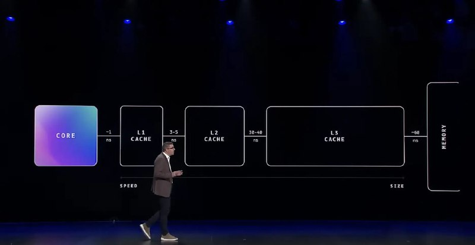

+++
title = "aws cpu memory ram"
date = 2026-01-25T06:14:34+00:00
description = "aws cpu memory ram From"

[taxonomies]
tags = ["aws", "cpu", "memory", "ram"]

[extra]
tg_url = "https://t.me/vitaly_zdanevich_chan/943"
og_image = "5451802121863892647_1269346597_460000935.jpg"
next_id = 944
next_title = "aws aws_lambda"
prev_id = 941
prev_title = "aws custom cpu: dropped the lid (scalping) for the better cooling"
views = 10
ids = [943]
+++

{{ tag(t="aws") }}
{{ tag(t="cpu") }}
{{ tag(t="memory") }}
{{ tag(t="ram") }}

From <https://youtu.be/JeUpUK0nhC0?t=1096>

{{ youtube(id="JeUpUK0nhC0") }}

