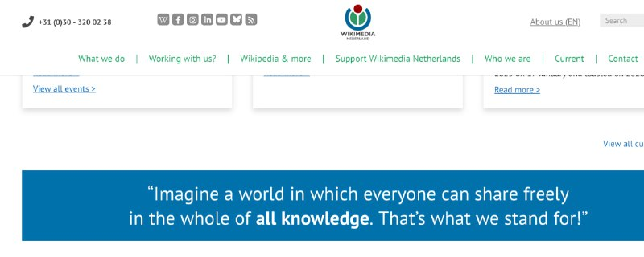
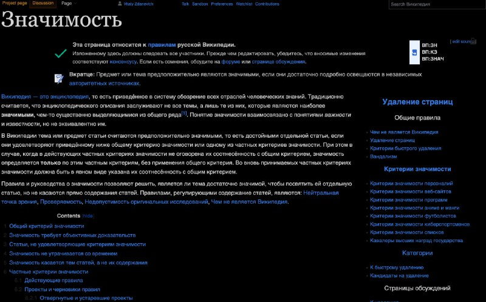

+++
title = ""
date = 2026-01-26T08:01:32+00:00
description = "wikipedia notability"

[taxonomies]
days = ["2026-01-26"]
tags = ["wikipedia", "notability"]

[extra]
id = 946
day = "2026-01-26"
tg_url = "https://t.me/vitaly_zdanevich_chan/946"
og_image = "01.jpg"
next_id = 948
next_title = ""
prev_id = 945
prev_title = ""
views = 12
ids = [946]
+++

{{ tag(t="wikipedia") }}
{{ tag(t="notability") }}

