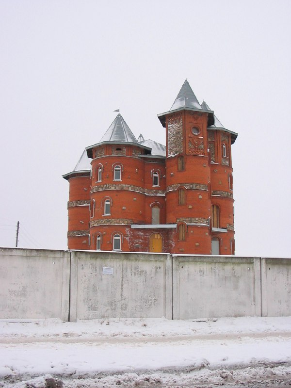

+++
title = "041-089 Марьина Горка, снято 23 января 2005.jpg"
date = 2026-01-28T05:48:55+00:00
description = "041-089 Марьина Горка, снято 23 января 2005.jpg belarus architecture castle winter марьинагорка year2005 globustut"

[taxonomies]
tags = ["belarus", "architecture", "castle", "winter", "марьина_горка", "year_2005", "globustut"]

[extra]
tg_url = "https://t.me/vitaly_zdanevich_chan/955"
og_image = "5460806022583750009_1271442981_460000633.jpg"
next_id = 956
next_title = "044-040 Раубичи, снято 7 февраля 2005.jpg"
prev_id = 954
prev_title = "041-038 Блонь, снято 23 января 2005.jpg"
views = 10
ids = [955]
+++

[041-089 Марьина Горка, снято 23 января 2005.jpg](https://commons.wikimedia.org/wiki/File:041-089_%D0%9C%D0%B0%D1%80%D1%8C%D0%B8%D0%BD%D0%B0_%D0%93%D0%BE%D1%80%D0%BA%D0%B0,_%D1%81%D0%BD%D1%8F%D1%82%D0%BE_23_%D1%8F%D0%BD%D0%B2%D0%B0%D1%80%D1%8F_2005.jpg)

{{ tag(t="belarus") }}
{{ tag(t="architecture") }}
{{ tag(t="castle") }}
{{ tag(t="winter") }}
{{ tag(t="марьина_горка") }}
{{ tag(t="year_2005") }}
{{ tag(t="globustut") }}

