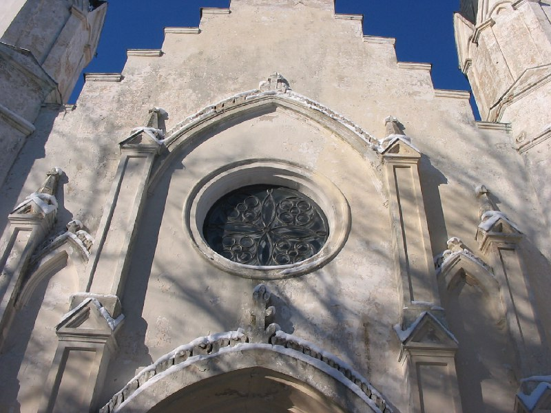

+++
title = ""
date = 2026-01-28T06:53:52+00:00
description = "belarus architecture church раубичи year2005 globustut From"

[taxonomies]
days = ["2026-01-28"]
tags = ["belarus", "architecture", "church", "раубичи", "year_2005", "globustut"]

[extra]
id = 956
day = "2026-01-28"
tg_url = "https://t.me/vitaly_zdanevich_chan/956"
og_image = "5460806022583750119_1271442981_460000743.jpg"
next_id = 957
next_title = ""
next_body = "#belarus\n#winter\n#куноса\n#year2005\n#globustut\nFrom"
prev_id = 955
prev_title = ""
prev_body = "#belarus\n#architecture\n#castle\n#winter\n#марьинагорка\n#year2005\n#globustut\nFrom"
views = 9
ids = [956]
+++

{{ tag(t="belarus") }}  
{{ tag(t="architecture") }}  
{{ tag(t="church") }}  
{{ tag(t="раубичи") }}  
{{ tag(t="year_2005") }}  
{{ tag(t="globustut") }}  

From [https://commons.wikimedia.org/wiki/File:044-040\_Раубичи,\_снято\_7\_февраля\_2005.jpg](https://commons.wikimedia.org/wiki/File:044-040_%D0%A0%D0%B0%D1%83%D0%B1%D0%B8%D1%87%D0%B8,_%D1%81%D0%BD%D1%8F%D1%82%D0%BE_7_%D1%84%D0%B5%D0%B2%D1%80%D0%B0%D0%BB%D1%8F_2005.jpg)

