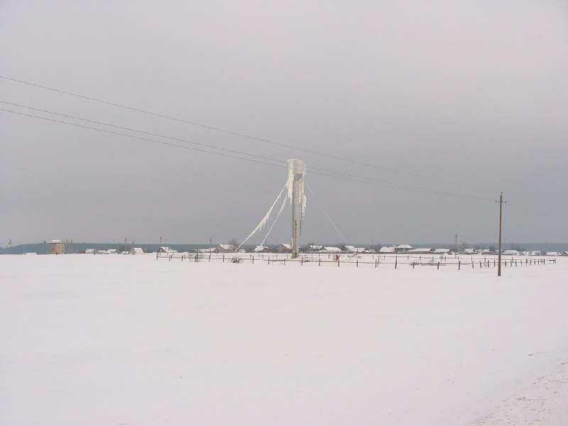

+++
title = ""
date = 2026-01-28T07:48:08+00:00
description = "belarus winter куноса year2005 globustut From"

[taxonomies]
days = ["2026-01-28"]
tags = ["belarus", "winter", "куноса", "year_2005", "globustut"]

[extra]
id = 957
day = "2026-01-28"
tg_url = "https://t.me/vitaly_zdanevich_chan/957"
og_image = "5460806022583750227_1271442981_460000851.jpg"
next_id = 958
next_title = ""
next_body = "#belarus\n#church\n#несвиж\n#year2005\n#globustut\nFrom"
prev_id = 956
prev_title = ""
prev_body = "#belarus\n#architecture\n#church\n#раубичи\n#year2005\n#globustut\nFrom"
views = 10
ids = [957]
+++

{{ tag(t="belarus") }}  
{{ tag(t="winter") }}  
{{ tag(t="куноса") }}  
{{ tag(t="year_2005") }}  
{{ tag(t="globustut") }}  

From [https://commons.wikimedia.org/wiki/File:042-077\_Куноса,\_снято\_29\_января\_2005.jpg](https://commons.wikimedia.org/wiki/File:042-077_%D0%9A%D1%83%D0%BD%D0%BE%D1%81%D0%B0,_%D1%81%D0%BD%D1%8F%D1%82%D0%BE_29_%D1%8F%D0%BD%D0%B2%D0%B0%D1%80%D1%8F_2005.jpg)

