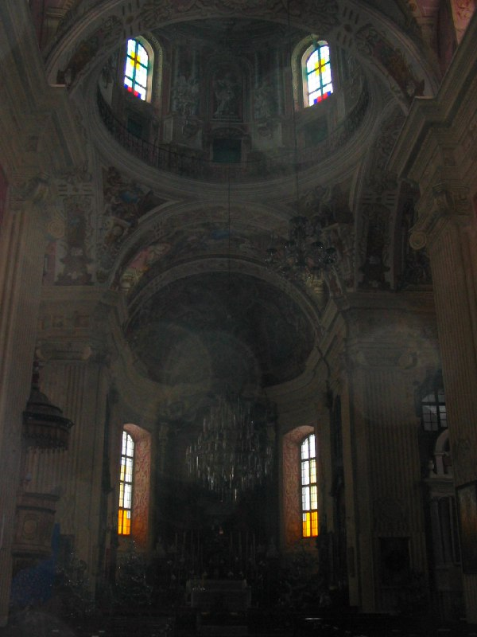

+++
title = ""
date = 2026-01-28T07:50:00+00:00
description = "belarus church несвиж year2005 globustut From"

[taxonomies]
days = ["2026-01-28"]
tags = ["belarus", "church", "несвиж", "year_2005", "globustut"]

[extra]
id = 958
day = "2026-01-28"
tg_url = "https://t.me/vitaly_zdanevich_chan/958"
og_image = "5460806022583750231_1271442981_460000855.jpg"
next_id = 959
next_title = ""
prev_id = 957
prev_title = ""
views = 7
ids = [958]
+++

{{ tag(t="belarus") }}  
{{ tag(t="church") }}  
{{ tag(t="несвиж") }}  
{{ tag(t="year_2005") }}  
{{ tag(t="globustut") }}  

From [https://commons.wikimedia.org/wiki/File:042-319\_Несвиж,\_фарный\_костел\_(внутри),\_снято\_29\_января\_2005.jpg](https://commons.wikimedia.org/wiki/File:042-319_%D0%9D%D0%B5%D1%81%D0%B2%D0%B8%D0%B6,_%D1%84%D0%B0%D1%80%D0%BD%D1%8B%D0%B9_%D0%BA%D0%BE%D1%81%D1%82%D0%B5%D0%BB_(%D0%B2%D0%BD%D1%83%D1%82%D1%80%D0%B8),_%D1%81%D0%BD%D1%8F%D1%82%D0%BE_29_%D1%8F%D0%BD%D0%B2%D0%B0%D1%80%D1%8F_2005.jpg)

