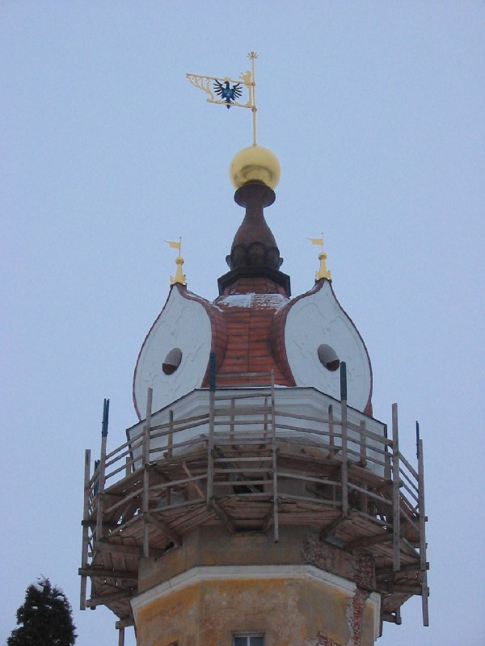

+++
title = ""
date = 2026-01-28T07:54:03+00:00
description = "belarus architecture church несвиж year2005 globustut From"

[taxonomies]
days = ["2026-01-28"]
tags = ["belarus", "architecture", "church", "несвиж", "year_2005", "globustut"]

[extra]
id = 961
day = "2026-01-28"
tg_url = "https://t.me/vitaly_zdanevich_chan/961"
og_image = "5460806022583750248_1271442981_460000872.jpg"
next_id = 962
next_title = ""
prev_id = 960
prev_title = ""
views = 9
ids = [961]
+++

{{ tag(t="belarus") }}  
{{ tag(t="architecture") }}  
{{ tag(t="church") }}  
{{ tag(t="несвиж") }}  
{{ tag(t="year_2005") }}  
{{ tag(t="globustut") }}  

From [https://commons.wikimedia.org/wiki/File:042-405\_Несвиж,\_снято\_29\_января\_2005.jpg](https://commons.wikimedia.org/wiki/File:042-405_%D0%9D%D0%B5%D1%81%D0%B2%D0%B8%D0%B6,_%D1%81%D0%BD%D1%8F%D1%82%D0%BE_29_%D1%8F%D0%BD%D0%B2%D0%B0%D1%80%D1%8F_2005.jpg)

