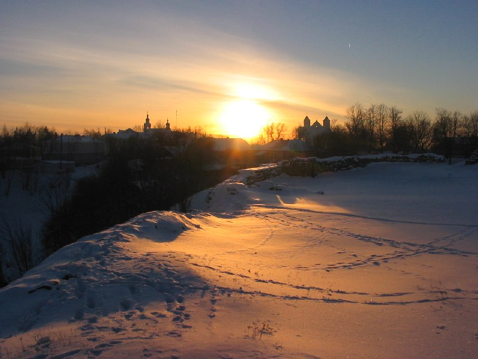
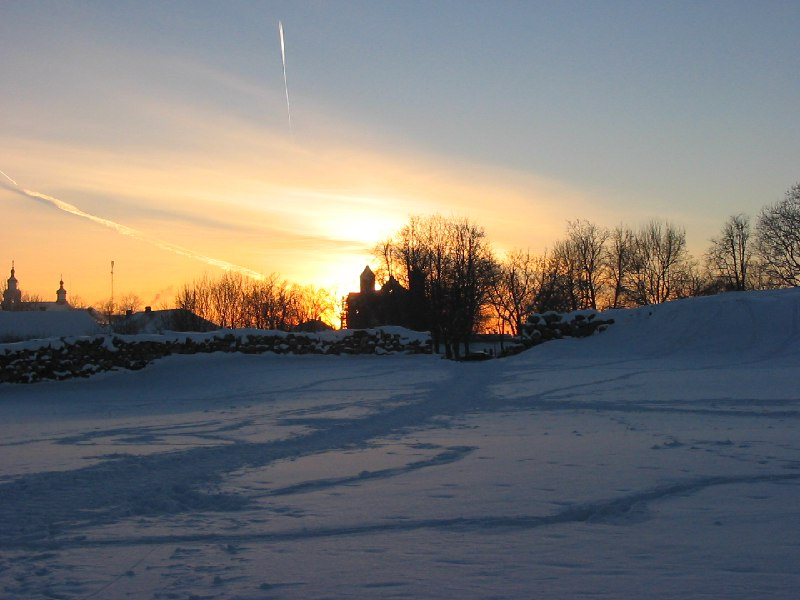
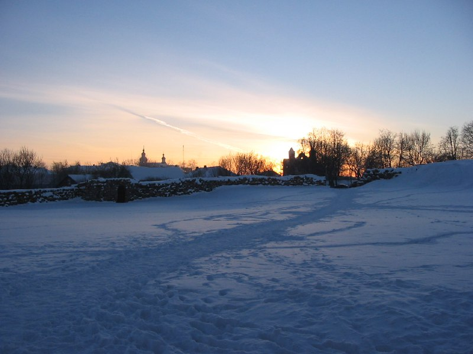
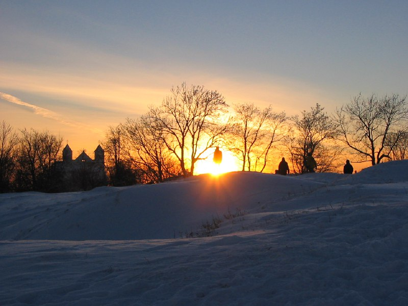
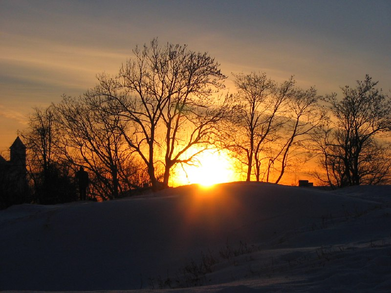
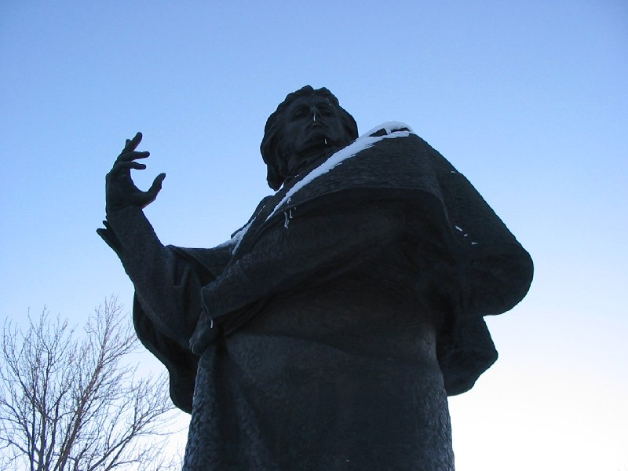
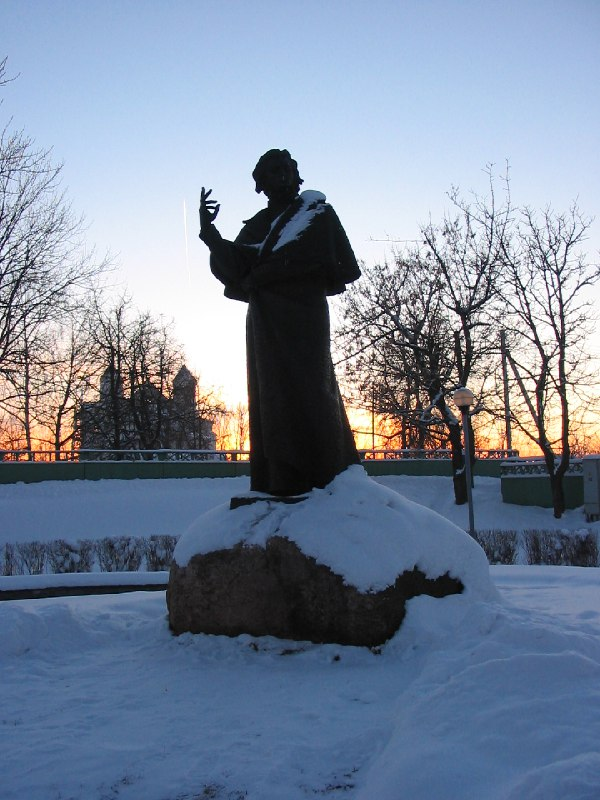

+++
title = "043-433 Новогрудок, снято 5 февраля 2005.jpg"
date = 2026-01-29T06:37:31+00:00
description = "043-433 Новогрудок, снято 5 февраля 2005.jpg belarus nature winter monument year2005 novogrudok"

[taxonomies]
tags = ["belarus", "nature", "winter", "monument", "year_2005", "novogrudok"]

[extra]
tg_url = "https://t.me/vitaly_zdanevich_chan/1006"
og_image = "01.jpg"
next_id = 1013
next_title = "webdesign blue batumi"
prev_id = 1000
prev_title = "043-387 Новогрудок, снято 5 февраля 2005.jpg"
views = 7
ids = [1006]
+++

[043-433 Новогрудок, снято 5 февраля 2005.jpg](https://commons.wikimedia.org/wiki/File:043-433_%D0%9D%D0%BE%D0%B2%D0%BE%D0%B3%D1%80%D1%83%D0%B4%D0%BE%D0%BA,_%D1%81%D0%BD%D1%8F%D1%82%D0%BE_5_%D1%84%D0%B5%D0%B2%D1%80%D0%B0%D0%BB%D1%8F_2005.jpg)

{{ tag(t="belarus") }}
{{ tag(t="nature") }}
{{ tag(t="winter") }}
{{ tag(t="monument") }}
{{ tag(t="year_2005") }}
{{ tag(t="novogrudok") }}

