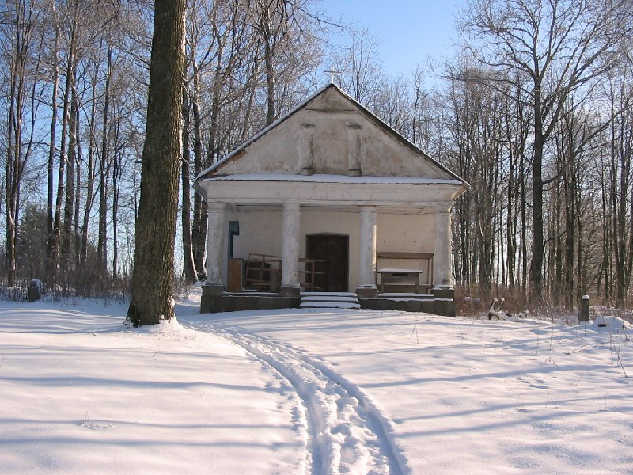

+++
title = "043-048 Вселюб, усыпальница, снято 5 февраля 2005.jpg"
date = 2026-01-29T05:04:31+00:00
description = "043-048 Вселюб, усыпальница, снято 5 февраля 2005.jpg belarus architecture church вселюб year2005 globustut"

[taxonomies]
tags = ["belarus", "architecture", "church", "вселюб", "year_2005", "globustut"]

[extra]
tg_url = "https://t.me/vitaly_zdanevich_chan/962"
og_image = "5465427364444572439_1272518971_460000023.jpg"
next_id = 963
next_title = "043-178 Любча, снято 5 февраля 2005.jpg"
prev_id = 961
prev_title = "042-405 Несвиж, снято 29 января 2005.jpg"
views = 6
ids = [962]
+++

[043-048 Вселюб, усыпальница, снято 5 февраля 2005.jpg](https://commons.wikimedia.org/wiki/File:043-048_%D0%92%D1%81%D0%B5%D0%BB%D1%8E%D0%B1,_%D1%83%D1%81%D1%8B%D0%BF%D0%B0%D0%BB%D1%8C%D0%BD%D0%B8%D1%86%D0%B0,_%D1%81%D0%BD%D1%8F%D1%82%D0%BE_5_%D1%84%D0%B5%D0%B2%D1%80%D0%B0%D0%BB%D1%8F_2005.jpg)

{{ tag(t="belarus") }}
{{ tag(t="architecture") }}
{{ tag(t="church") }}
{{ tag(t="вселюб") }}
{{ tag(t="year_2005") }}
{{ tag(t="globustut") }}

