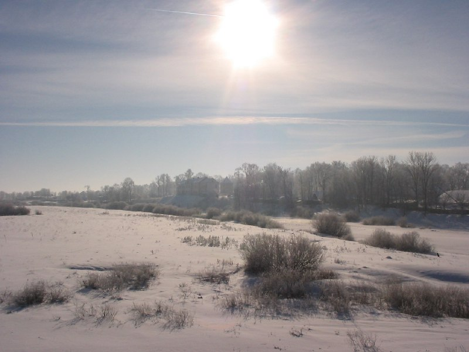
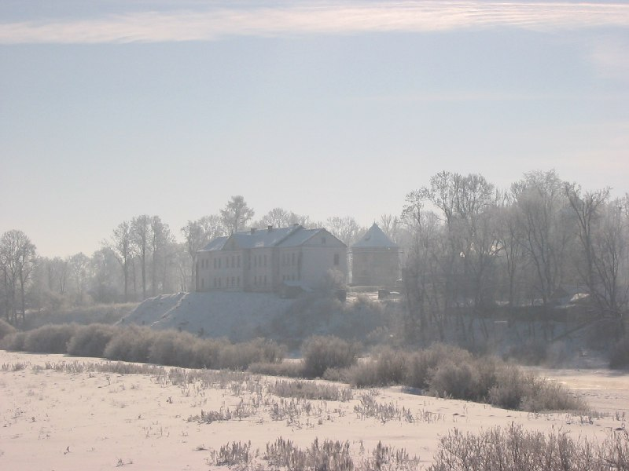
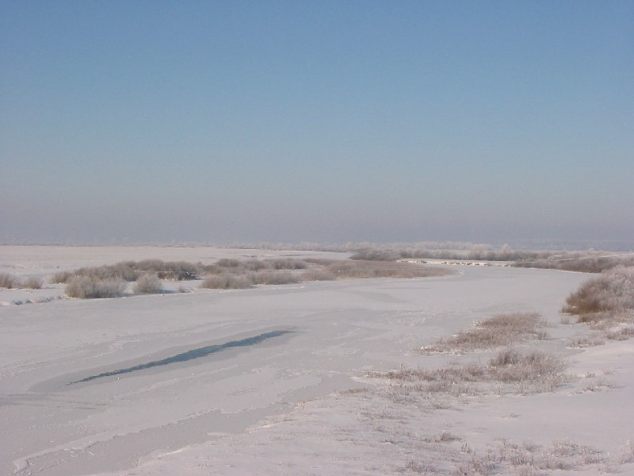
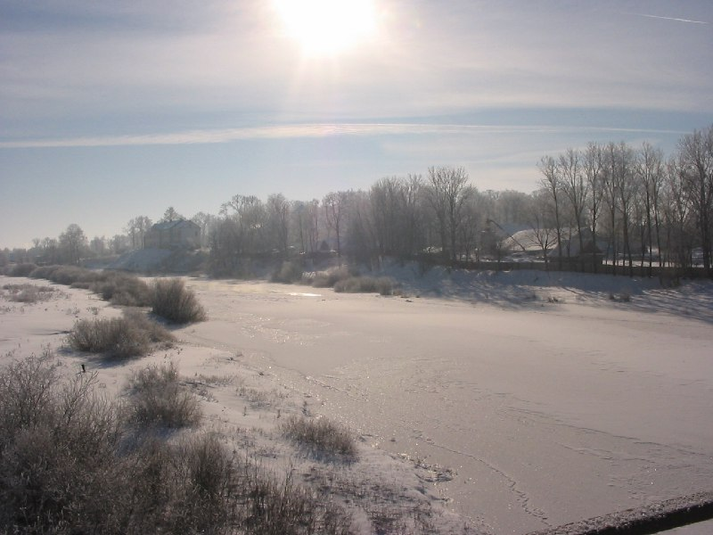
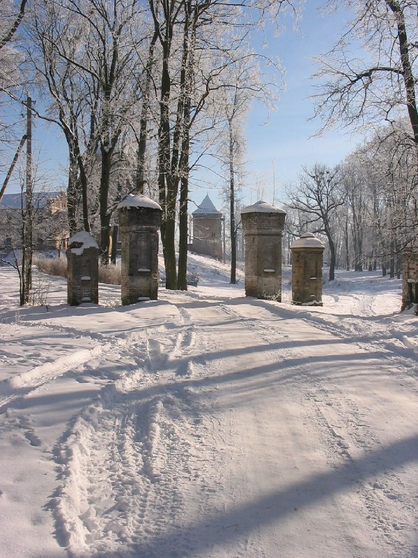
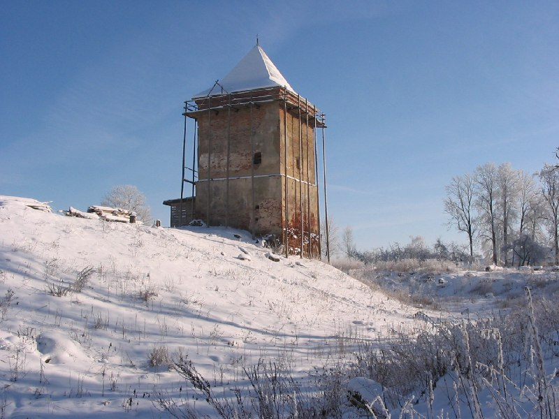

+++
title = "043-178 Любча, снято 5 февраля 2005.jpg"
date = 2026-01-29T05:09:17+00:00
description = "043-178 Любча, снято 5 февраля 2005.jpg belarus nature winter любча year2005 globustut"

[taxonomies]
tags = ["belarus", "nature", "winter", "любча", "year_2005", "globustut"]

[extra]
tg_url = "https://t.me/vitaly_zdanevich_chan/963"
og_image = "01.jpg"
next_id = 969
next_title = "043-196 Любча, флигель, снято 5 февраля 2005.jpg"
prev_id = 962
prev_title = "043-048 Вселюб, усыпальница, снято 5 февраля 2005.jpg"
views = 7
ids = [963]
+++

[043-178 Любча, снято 5 февраля 2005.jpg](https://commons.wikimedia.org/wiki/File:043-178_%D0%9B%D1%8E%D0%B1%D1%87%D0%B0,_%D1%81%D0%BD%D1%8F%D1%82%D0%BE_5_%D1%84%D0%B5%D0%B2%D1%80%D0%B0%D0%BB%D1%8F_2005.jpg)

{{ tag(t="belarus") }}
{{ tag(t="nature") }}
{{ tag(t="winter") }}
{{ tag(t="любча") }}
{{ tag(t="year_2005") }}
{{ tag(t="globustut") }}

