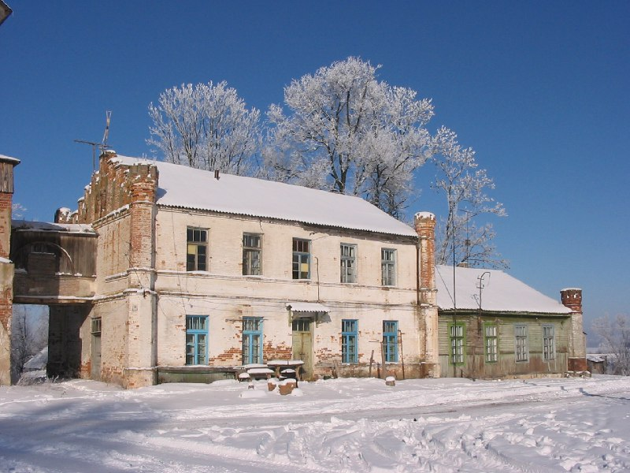
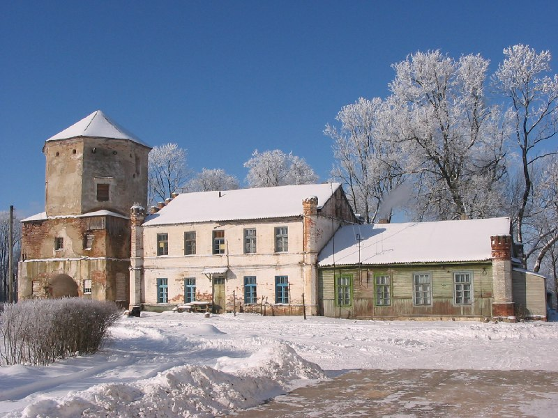
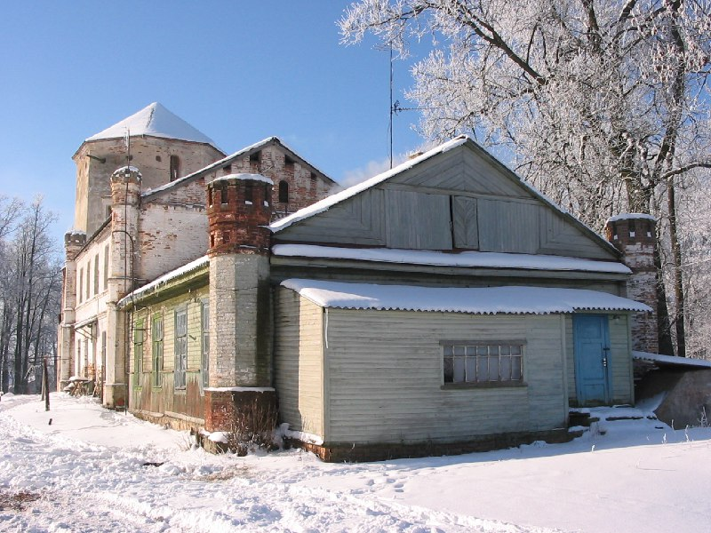
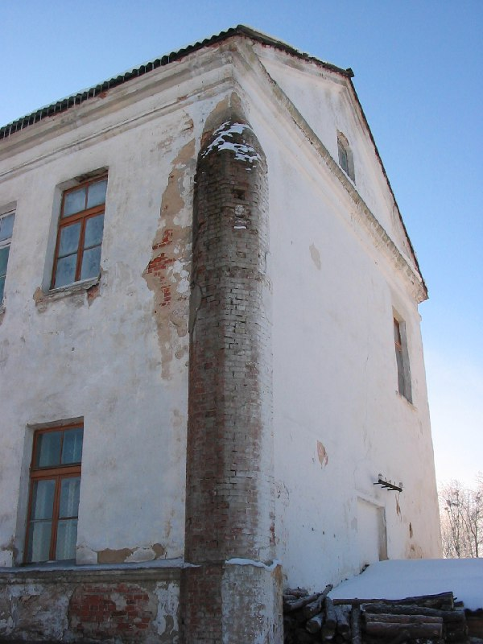
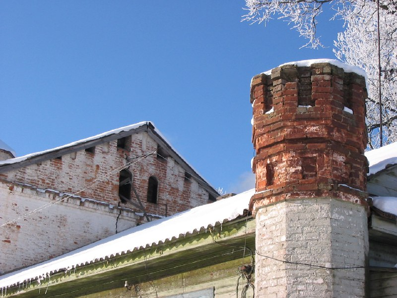
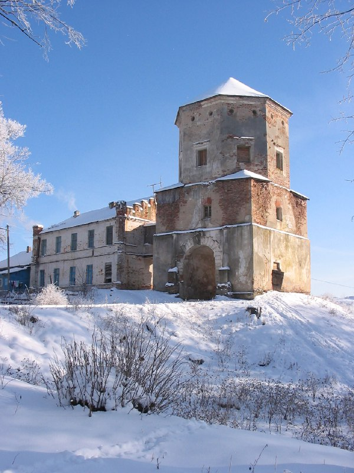
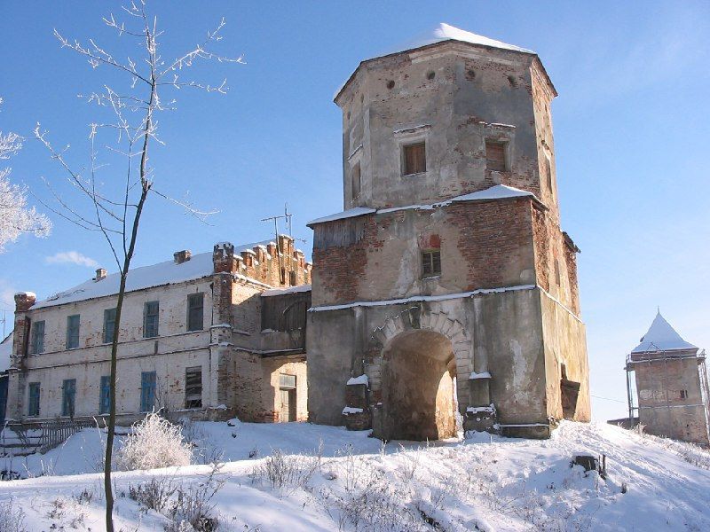

+++
title = ""
date = 2026-01-29T06:04:39+00:00
description = "belarus architecture winter любча year2005 globustut From"

[taxonomies]
days = ["2026-01-29"]
tags = ["belarus", "architecture", "winter", "любча", "year_2005", "globustut"]

[extra]
id = 969
day = "2026-01-29"
tg_url = "https://t.me/vitaly_zdanevich_chan/969"
og_image = "01.jpg"
next_id = 976
next_title = ""
prev_id = 963
prev_title = ""
views = 7
ids = [969]
+++

{{ tag(t="belarus") }}  
{{ tag(t="architecture") }}  
{{ tag(t="winter") }}  
{{ tag(t="любча") }}  
{{ tag(t="year_2005") }}  
{{ tag(t="globustut") }}  

From [https://commons.wikimedia.org/wiki/File:043-196\_Любча,\_флигель,\_снято\_5\_февраля\_2005.jpg](https://commons.wikimedia.org/wiki/File:043-196_%D0%9B%D1%8E%D0%B1%D1%87%D0%B0,_%D1%84%D0%BB%D0%B8%D0%B3%D0%B5%D0%BB%D1%8C,_%D1%81%D0%BD%D1%8F%D1%82%D0%BE_5_%D1%84%D0%B5%D0%B2%D1%80%D0%B0%D0%BB%D1%8F_2005.jpg)

