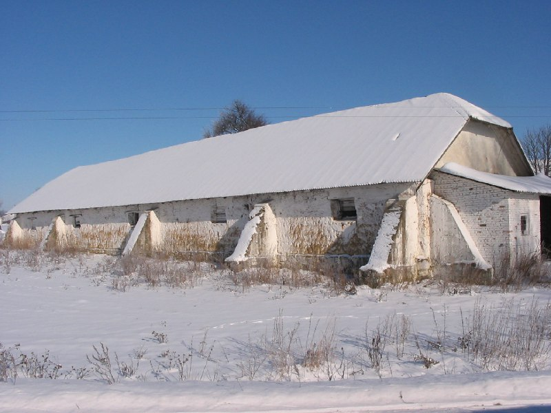
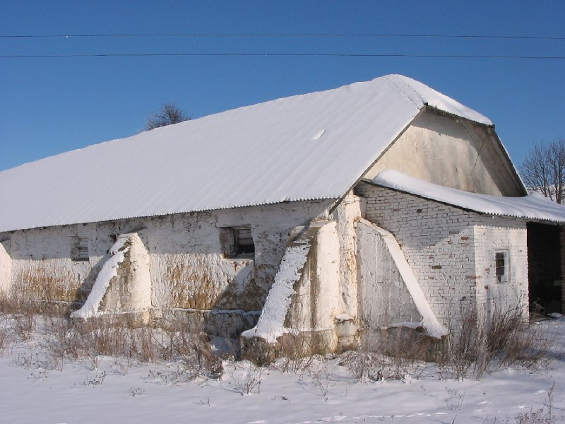
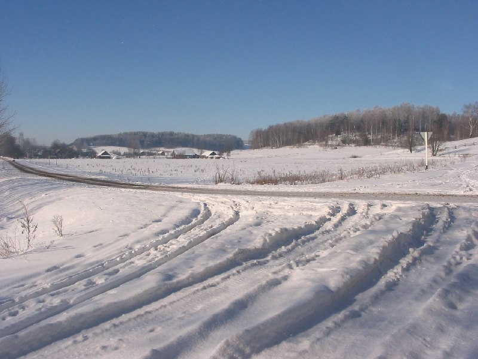

+++
title = "043-239 Полберег, хозп-ка, снято 5 февраля 2005.jpg"
date = 2026-01-29T06:10:28+00:00
description = "043-239 Полберег, хозп-ка, снято 5 февраля 2005.jpg belarus architecture winter полберег year2005 globustut"

[taxonomies]
tags = ["belarus", "architecture", "winter", "полберег", "year_2005", "globustut"]

[extra]
tg_url = "https://t.me/vitaly_zdanevich_chan/983"
og_image = "01.jpg"
next_id = 986
next_title = "043-241 Полберег, дом (или хозп-ка), снято 5 февраля 2005.jpg"
prev_id = 976
prev_title = "043-222 близ Няньково, мемор валун, снято 5 февраля 2005.jpg"
views = 8
ids = [983]
+++

[043-239 Полберег, хозп-ка, снято 5 февраля 2005.jpg](https://commons.wikimedia.org/wiki/File:043-239_%D0%9F%D0%BE%D0%BB%D0%B1%D0%B5%D1%80%D0%B5%D0%B3,_%D1%85%D0%BE%D0%B7%D0%BF-%D0%BA%D0%B0,_%D1%81%D0%BD%D1%8F%D1%82%D0%BE_5_%D1%84%D0%B5%D0%B2%D1%80%D0%B0%D0%BB%D1%8F_2005.jpg)

{{ tag(t="belarus") }}
{{ tag(t="architecture") }}
{{ tag(t="winter") }}
{{ tag(t="полберег") }}
{{ tag(t="year_2005") }}
{{ tag(t="globustut") }}

