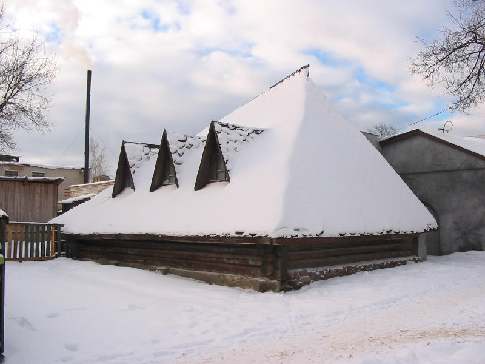

+++
title = "045-033 Лепель, напротив старой ц, снято 12 февраля 2005.jpg"
date = 2026-01-30T10:15:12+00:00
description = "045-033 Лепель, напротив старой ц, снято 12 февраля 2005.jpg belarus architecture winter лепель year2005 globustut"

[taxonomies]
tags = ["belarus", "architecture", "winter", "лепель", "year_2005", "globustut"]

[extra]
tg_url = "https://t.me/vitaly_zdanevich_chan/1014"
og_image = "5469697399455419433_1273513166_460000297.jpg"
next_id = 1015
next_title = "045-144 Почаевичи, снято 12 февраля 2005.jpg"
prev_id = 1013
prev_title = "webdesign blue batumi"
views = 6
ids = [1014]
+++

[045-033 Лепель, напротив старой ц, снято 12 февраля 2005.jpg](https://commons.wikimedia.org/wiki/File:045-033_%D0%9B%D0%B5%D0%BF%D0%B5%D0%BB%D1%8C,_%D0%BD%D0%B0%D0%BF%D1%80%D0%BE%D1%82%D0%B8%D0%B2_%D1%81%D1%82%D0%B0%D1%80%D0%BE%D0%B9_%D1%86,_%D1%81%D0%BD%D1%8F%D1%82%D0%BE_12_%D1%84%D0%B5%D0%B2%D1%80%D0%B0%D0%BB%D1%8F_2005.jpg)

{{ tag(t="belarus") }}
{{ tag(t="architecture") }}
{{ tag(t="winter") }}
{{ tag(t="лепель") }}
{{ tag(t="year_2005") }}
{{ tag(t="globustut") }}

