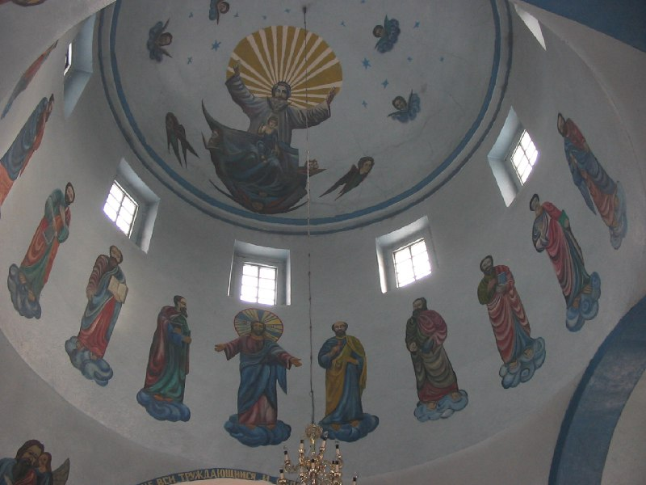

+++
title = ""
date = 2026-01-30T10:20:53+00:00
description = "belarus church чашники year2005 globustut From"

[taxonomies]
days = ["2026-01-30"]
tags = ["belarus", "church", "чашники", "year_2005", "globustut"]

[extra]
id = 1025
day = "2026-01-30"
tg_url = "https://t.me/vitaly_zdanevich_chan/1025"
og_image = "01.jpg"
next_id = 1028
next_title = ""
next_body = "#belarus\n#abandone\n#year2005\n#иванск\n#globustut\nFrom"
prev_id = 1015
prev_title = ""
prev_body = "#belarus\n#abandone\n#winter\n#почаевичи\n#year2005\n#globustut\nFrom"
views = 5
ids = [1025]
+++

{{ tag(t="belarus") }}  
{{ tag(t="church") }}  
{{ tag(t="чашники") }}  
{{ tag(t="year_2005") }}  
{{ tag(t="globustut") }}  

From [https://commons.wikimedia.org/wiki/File:045-183\_Чашники,\_снято\_12\_февраля\_2005.jpg](https://commons.wikimedia.org/wiki/File:045-183_%D0%A7%D0%B0%D1%88%D0%BD%D0%B8%D0%BA%D0%B8,_%D1%81%D0%BD%D1%8F%D1%82%D0%BE_12_%D1%84%D0%B5%D0%B2%D1%80%D0%B0%D0%BB%D1%8F_2005.jpg)

