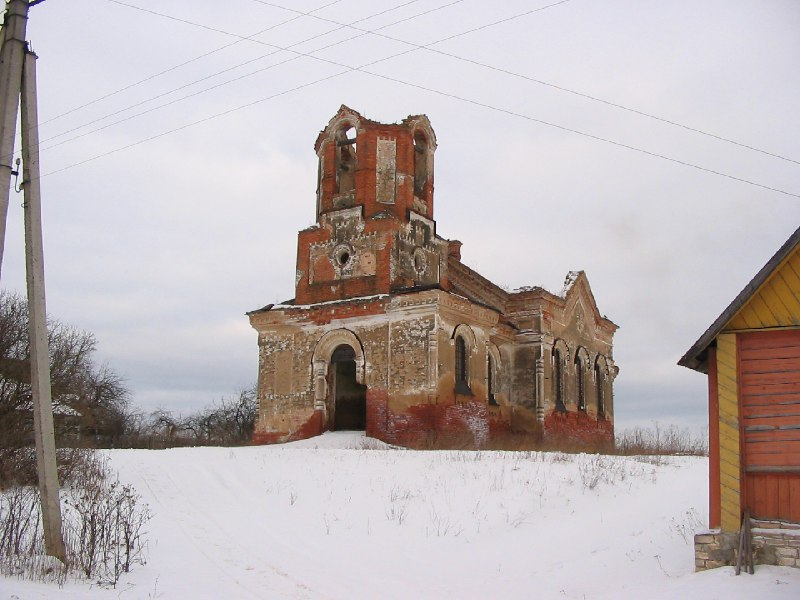
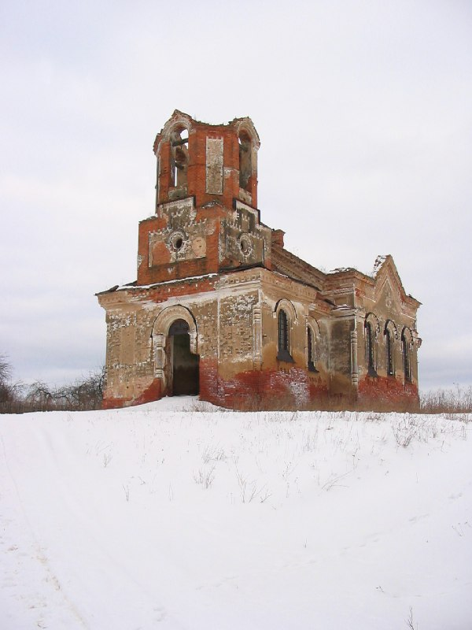
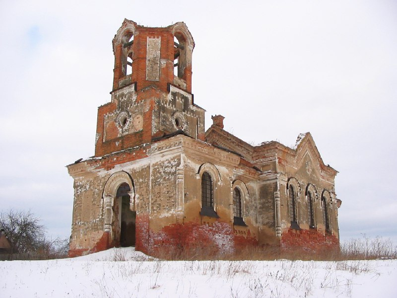
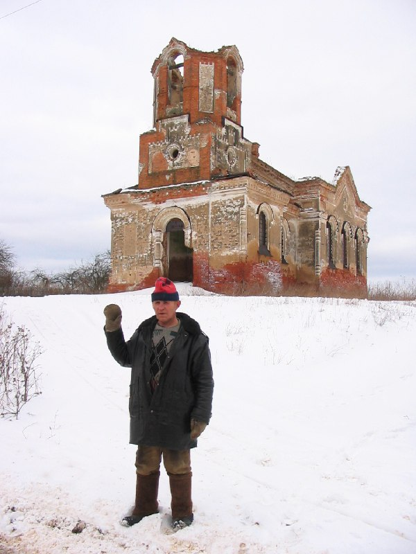

+++
title = ""
date = 2026-01-30T11:06:14+00:00
description = "belarus свеча abandone church winter year2005 abandone From"

[taxonomies]
days = ["2026-01-30"]
tags = ["belarus", "свеча", "abandone", "church", "winter", "year_2005"]

[extra]
id = 1042
day = "2026-01-30"
tg_url = "https://t.me/vitaly_zdanevich_chan/1042"
og_image = "01.jpg"
next_id = 1046
next_title = ""
next_body = "#belarus\n#abandone\n#church\n#слабодка\n#winter\n#year2005\n#globustut\nFrom"
prev_id = 1037
prev_title = ""
prev_body = "#belarus\n#abandone\n#pillar\n#бочейково\n#winter\n#year2025\n#globustut\nFrom"
views = 5
ids = [1042]
+++

{{ tag(t="belarus") }}  
{{ tag(t="свеча") }}  
{{ tag(t="abandone") }}  
{{ tag(t="church") }}  
{{ tag(t="winter") }}  
{{ tag(t="year_2005") }}  
{{ tag(t="abandone") }}  

From [https://commons.wikimedia.org/wiki/File:045-309\_Свеча,\_снято\_12\_февраля\_2005.jpg](https://commons.wikimedia.org/wiki/File:045-309_%D0%A1%D0%B2%D0%B5%D1%87%D0%B0,_%D1%81%D0%BD%D1%8F%D1%82%D0%BE_12_%D1%84%D0%B5%D0%B2%D1%80%D0%B0%D0%BB%D1%8F_2005.jpg)

