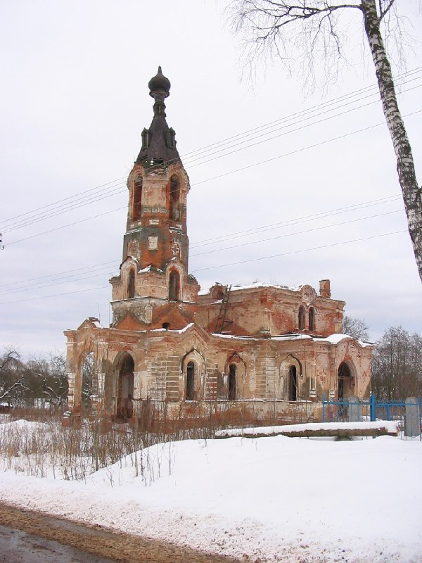
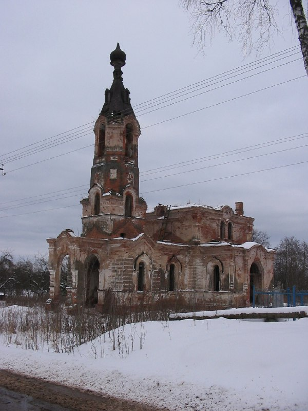
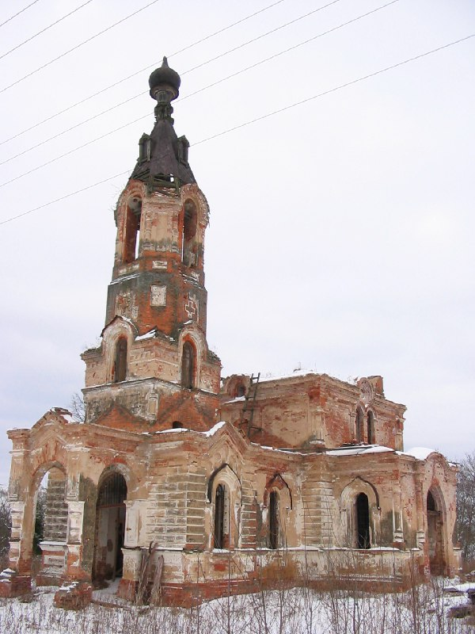
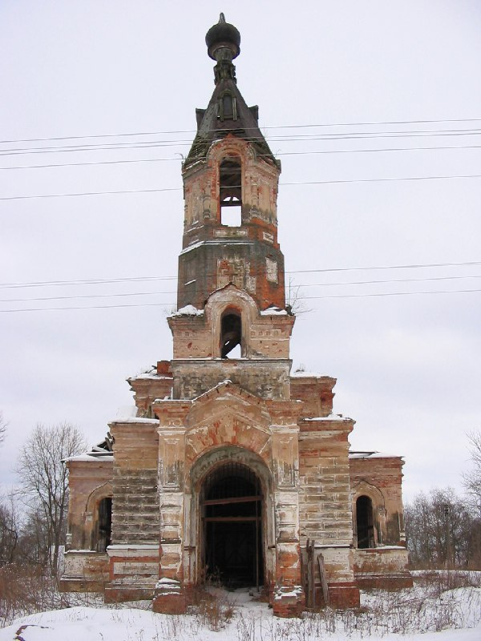
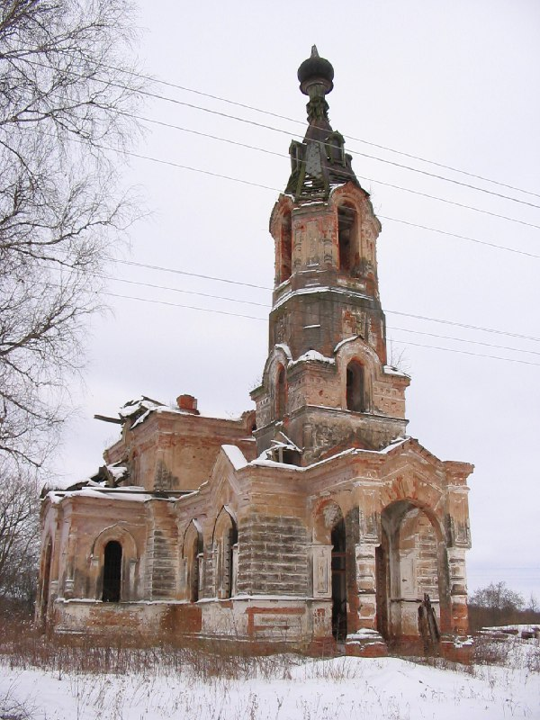
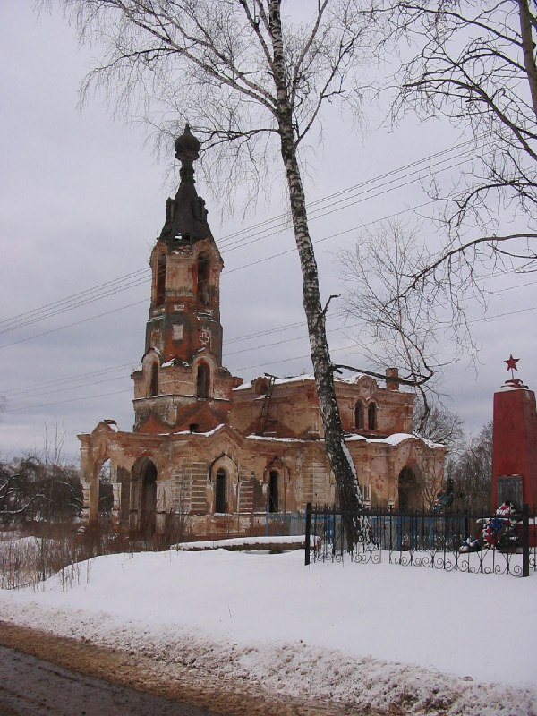

+++
title = ""
date = 2026-01-30T11:08:03+00:00
description = "belarus abandone church слабодка winter year2005 globustut From"

[taxonomies]
days = ["2026-01-30"]
tags = ["belarus", "abandone", "church", "слабодка", "winter", "year_2005", "globustut"]

[extra]
id = 1046
day = "2026-01-30"
tg_url = "https://t.me/vitaly_zdanevich_chan/1046"
og_image = "01.jpg"
next_id = 1052
next_title = ""
prev_id = 1042
prev_title = ""
views = 7
ids = [1046]
+++

{{ tag(t="belarus") }}
{{ tag(t="abandone") }}
{{ tag(t="church") }}
{{ tag(t="слабодка") }}
{{ tag(t="winter") }}
{{ tag(t="year_2005") }}
{{ tag(t="globustut") }}

From [https://commons.wikimedia.org/wiki/File:045-310\_Слабодка\_(Бешенк\_р-н),\_снято\_12\_февраля\_2005.jpg](https://commons.wikimedia.org/wiki/File:045-310_%D0%A1%D0%BB%D0%B0%D0%B1%D0%BE%D0%B4%D0%BA%D0%B0_(%D0%91%D0%B5%D1%88%D0%B5%D0%BD%D0%BA_%D1%80-%D0%BD),_%D1%81%D0%BD%D1%8F%D1%82%D0%BE_12_%D1%84%D0%B5%D0%B2%D1%80%D0%B0%D0%BB%D1%8F_2005.jpg)

