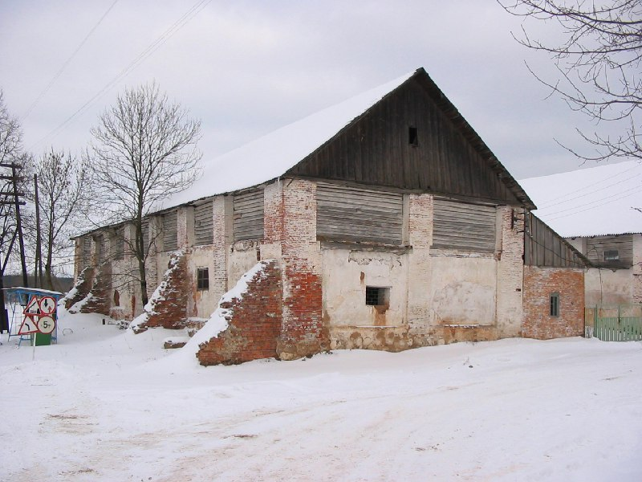

+++
title = ""
date = 2026-01-30T11:15:41+00:00
description = "belarus architecture winter year2005 globustut From"

[taxonomies]
days = ["2026-01-30"]
tags = ["belarus", "architecture", "winter", "year_2005", "globustut"]

[extra]
id = 1054
day = "2026-01-30"
tg_url = "https://t.me/vitaly_zdanevich_chan/1054"
og_image = "5469697399455419615_1273513166_460000479.jpg"
next_id = 1055
next_title = ""
next_body = "#belarus\n#sign\n#winter\n#year2005\n#globustut\nРубеж\nFrom"
prev_id = 1052
prev_title = ""
prev_body = "#belarus\n#бешенковичи\n#font\n#church\n#winter\n#year2005\n#globustut\nFrom"
views = 6
ids = [1054]
+++

{{ tag(t="belarus") }}  
{{ tag(t="architecture") }}  
{{ tag(t="winter") }}  
{{ tag(t="year_2005") }}  
{{ tag(t="globustut") }}  

From [https://commons.wikimedia.org/wiki/File:045-331\_Бешенковичи,\_хозп-ки\_у\_парома,\_снято\_12\_февраля\_2005.jpg](https://commons.wikimedia.org/wiki/File:045-331_%D0%91%D0%B5%D1%88%D0%B5%D0%BD%D0%BA%D0%BE%D0%B2%D0%B8%D1%87%D0%B8,_%D1%85%D0%BE%D0%B7%D0%BF-%D0%BA%D0%B8_%D1%83_%D0%BF%D0%B0%D1%80%D0%BE%D0%BC%D0%B0,_%D1%81%D0%BD%D1%8F%D1%82%D0%BE_12_%D1%84%D0%B5%D0%B2%D1%80%D0%B0%D0%BB%D1%8F_2005.jpg)

