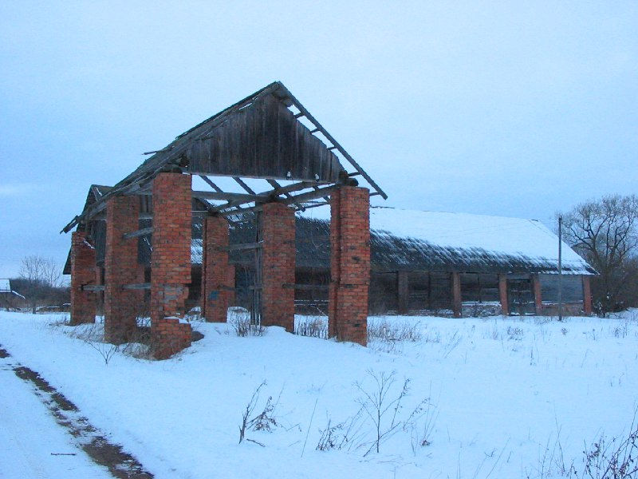

+++
title = "045-415 Турово, снято 12 февраля 2005.jpg"
date = 2026-01-30T11:18:07+00:00
description = "045-415 Турово, снято 12 февраля 2005.jpg belarus architecture abandone winter year2005 globustut"

[taxonomies]
tags = ["belarus", "architecture", "abandone", "winter", "year_2005", "globustut"]

[extra]
tg_url = "https://t.me/vitaly_zdanevich_chan/1058"
og_image = "5469697399455419625_1273513166_460000489.jpg"
next_id = 1059
next_title = "045-425 Сенно, снято 12 февраля 2005.jpg"
prev_id = 1055
prev_title = "Рубеж"
views = 6
ids = [1058]
+++

[045-415 Турово, снято 12 февраля 2005.jpg](https://commons.wikimedia.org/wiki/File:045-415_%D0%A2%D1%83%D1%80%D0%BE%D0%B2%D0%BE,_%D1%81%D0%BD%D1%8F%D1%82%D0%BE_12_%D1%84%D0%B5%D0%B2%D1%80%D0%B0%D0%BB%D1%8F_2005.jpg)

{{ tag(t="belarus") }}
{{ tag(t="architecture") }}
{{ tag(t="abandone") }}
{{ tag(t="winter") }}
{{ tag(t="year_2005") }}
{{ tag(t="globustut") }}

